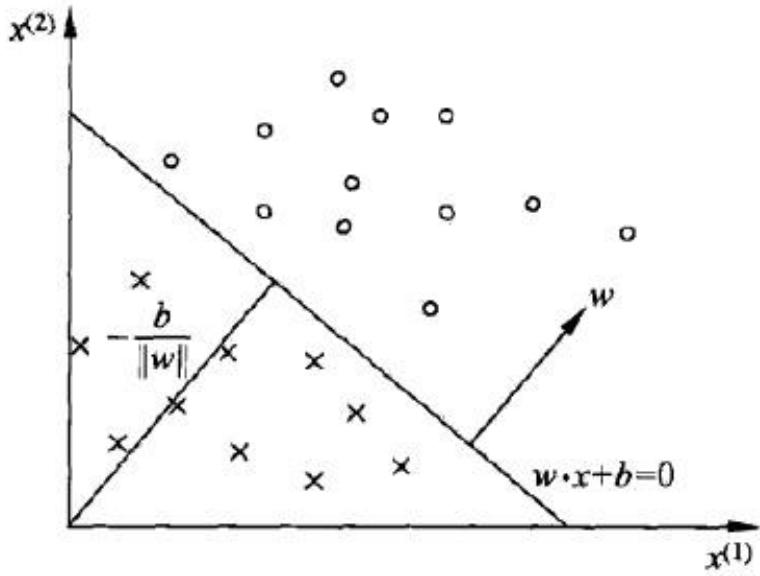
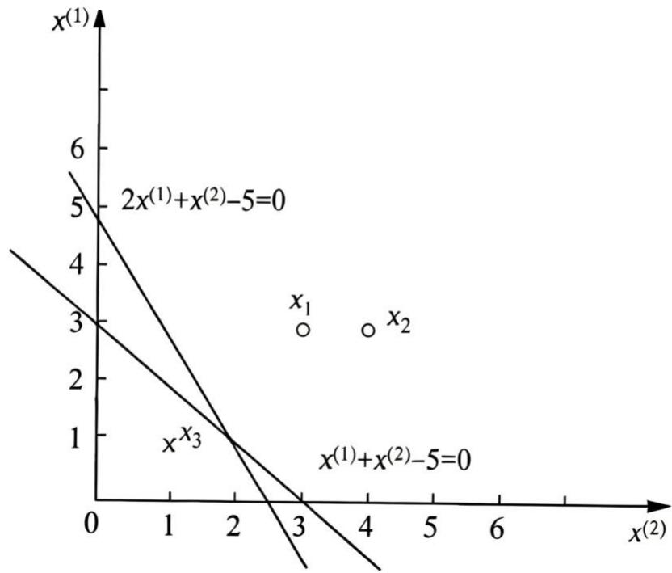
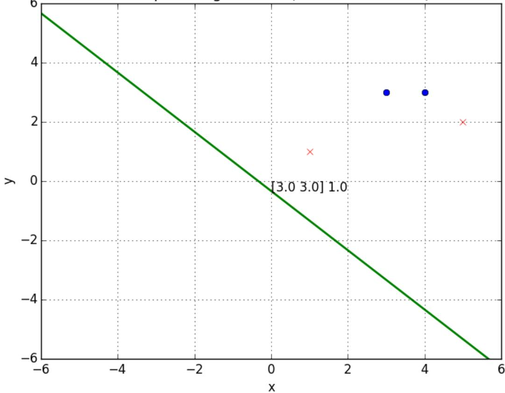

# 感知机

# Perceptron

# 感知机 Perceptron

• 感知机是二分类线性分类模型，属于判别模型  
• 1957年由Rosenblatt提出，是ANN和SVM的基础  
– 输入为实例的特征向量，输出为类别，+1和-1   
– 模型：感知机对应于输入空间中将实例划分为正负两类的分离超平面  
– 策略：使用基于误分类的损失函数；  
– 求解算法：利用SGD对损失函数进行极小化  
• 感知机学习分为原始形式和对偶形式

# 感知机模型

# • 定义(感知机)

设输入空间(特征空间)是 $\ b { { x } } \in \ b { { R } } ^ { n }$ , 输出空间是 $y =$ {+??,−??},输入?? ∈ ??表示样本的特征向量，对应于输入空间的点，输出 $y \in { \mathcal { Y } }$ 表示样本的类别，由输入空间到输出空间的函数： $\begin{array} { r } { f ( x ) = s i g n ( w \cdot x + b ) } \end{array}$ （20号称为感知机。

# 模型参数

权值向量 $w \in R ^ { n }$ ，偏置??， $w \cdot x$ 是内积$\pmb { s i g n }$ 是符号函数

$$
s i g n (x) = \left\{ \begin{array}{l l} + 1, & x \geq 0 \\ - 1, & x <   0 \end{array} \right.
$$

# 感知机几何解释

• 线性方程： $\pmb { w } \cdot \pmb { x } + \pmb { b } = 0$   
• 对应于特征空间 $R ^ { n }$ 的超平面S，w为超平面的法向量，b是超平面的截距，超平面将特征空间划分为两个部分，表示正、负类：  
分离超平面

text_image

x(2)
- b / ||w||
w
w·x+b=0
x(1)

# 线性可分数据集

• 给定数据集 $T = \{ ( x _ { 1 } , y _ { 1 } ) , ( x _ { 2 } , y _ { 2 } ) , \ldots , ( x _ { N } , y _ { N } ) \}$ ，

$$
x _ {i} \in \mathcal {X} = R ^ {n}, y _ {i} \in \mathcal {Y} = \{+ 1, - 1 \}, i = 1, 2, \dots N
$$

• 如果存在某个超平面S: $\pmb { w } \cdot \pmb { x } + \pmb { b } = 0$ ，能够将数据集的正实例点和负实例点完全正确的划分到超平面的两侧，则称数据集T为线性可分数据集(linearly separable data set)。

• 即：

$$
\pmb {w} \cdot \pmb {x} _ {i} + \pmb {b} > \mathbf {0}, \qquad \pmb {y} _ {i} = + \mathbf {1}
$$

$$
\pmb {w} \cdot \pmb {x} _ {i} + \pmb {b} <   \mathbf {0}, \qquad \pmb {y} _ {i} = - \mathbf {1}
$$

# 感知机学习策略

• 对于线性可分数据集，如何定义损失函数？

– 自然选择：误分类点的数目。

• 但损失函数不是 w,b 连续可导函数，不易优化

– 另一选择：误分类点到超平面S的总距离：

• $R ^ { n }$ 中任意一点 $x _ { 0 }$ 到超平面S的距离： ${ \frac { 1 } { \| w \| } } \ | w \cdot x _ { 0 } + b |$   
• 对于误分类点 $( x _ { i } , y _ { i } )$ ，有 $- y _ { i } ( w \cdot x _ { i } + b ) > \mathbf { 0 }$   
• 则：误分类 $x _ { i }$ 点到S的距离： $- \frac { 1 } { \| w \| } y _ { i } ( \pmb { w } \cdot \pmb { x } _ { i } + \pmb { b } )$   
• 误分类点集合M,所有误分类到S的总距离

$$
- \frac {1}{\| \boldsymbol {w} \|} \sum_ {\boldsymbol {x} _ {i} \in \boldsymbol {M}} \boldsymbol {y} _ {i} (\boldsymbol {w} \cdot \boldsymbol {x} _ {i} + \boldsymbol {b})
$$

# 感知机学习策略

损失函数：

– 不考虑 ?? $\frac { 1 } { \| \pmb { w } \| }$ 得到感知机学习的损失函数

$$
L (\boldsymbol {w}, \boldsymbol {b}) = - \sum_ {\boldsymbol {x} _ {i} \in \boldsymbol {M}} \boldsymbol {y} _ {i} (\boldsymbol {w} \cdot \boldsymbol {x} _ {i} + \boldsymbol {b})
$$

– M为误分类点的数目

• 该损失函数就是感知机的经验风险函数  
如果没有误分类点， ${ \mathsf { L } } = 0$   
• 误分类点越少，误分类点离超平面S越近，损失 函数值越小

# 感知机学习算法

• 给定数据集 $T = \{ ( x _ { 1 } , y _ { 1 } ) , ( x _ { 2 } , y _ { 2 } ) , \ldots , ( x _ { N } , y _ { N } ) \}$ ，

$$
x _ {i} \in \mathcal {X} = R ^ {n}, y _ {i} \in \mathcal {Y} = \{+ 1, - 1 \}, i = 1, 2, \dots N,
$$

求参数w,b，使其为损失函数极小化问题的解

$$
\min _ {w, b} L (\boldsymbol {w}, \boldsymbol {b}) = - \sum_ {x _ {i} \in M} \boldsymbol {y} _ {i} (\boldsymbol {w} \cdot x _ {i} + \boldsymbol {b})
$$

M为误分类点的数目。

# 感知机学习算法

$$
\min _ {w, b} L (\boldsymbol {w}, \boldsymbol {b}) = - \sum_ {x _ {i} \in \boldsymbol {M}} \boldsymbol {y} _ {i} (\boldsymbol {w} \cdot x _ {i} + \boldsymbol {b})
$$

• 采用SGD求解:首先任意选择一个超平面 ${ \bf { \delta } } w _ { 0 } , b _ { 0 }$ ，然后不断极小化目标函数,损失函数??的梯度：

$$
\nabla_ {\boldsymbol {w}} L (\boldsymbol {w}, \boldsymbol {b}) = - \sum_ {x _ {i} \in \boldsymbol {M}} \boldsymbol {y} _ {i} x _ {i}
$$

$$
\nabla_ {\boldsymbol {b}} L (\boldsymbol {w}, \boldsymbol {b}) = - \sum_ {x _ {i} \in M} y _ {i}
$$

选取误分类点 $( x _ { i } , y _ { i } )$ 更新：

$$
\boldsymbol {w} \leftarrow \boldsymbol {w} + \eta \mathbf {y} _ {i} x _ {i}
$$

$$
\pmb {b} \leftarrow \pmb {b} + \eta \mathbf {y} _ {i}
$$

$\pmb { \eta } ( \mathbf { 0 } < \pmb { \eta } \le \mathbf { 1 } )$ 是学习率。

# 感知机学习算法（原始形式）

输入：训练数据集 $T = \{ ( x _ { 1 } , y _ { 1 } ) , ( x _ { 2 } , y _ { 2 } ) , \ldots , ( x _ { N } , y _ { N } ) \}$ ，其中 $x _ { i } \in \mathcal { X } = R ^ { n } , y _ { i } \in \mathcal { Y } = \{ + 1 , - 1 \} , i = 1 , 2 , \ldots N$ ,学习率 $\eta ( 0 < \eta \leq 1 )$ ；

输出： ??, ??；感知机模型 $\pmb { f } ( \pmb { x } ) = s i g \pmb { n } ( \pmb { w } \cdot \pmb { x } + \pmb { b } )$

(1)选取初值 ${ \bf { \nabla } } w _ { 0 } , b _ { 0 }$   
(2)在训练集中选取数据 $( x _ { i } , y _ { i } )$   
(3)如果 $y _ { i } ( w \cdot x _ { i } + b ) \leq \mathbf { 0 }$

$$
\begin{array}{l} \boldsymbol {w} \leftarrow \boldsymbol {w} + \eta \mathbf {y} _ {i} x _ {i} \\ \boldsymbol {b} \leftarrow \boldsymbol {b} + \eta \mathbf {y} _ {i} \\ \end{array}
$$

(4)转至(2)，直至训练集中没有误分类点。

# 感知机学习算法 举例

例 2.1如图 2.2所示的训练数据集，其正实例点是 $x _ { 1 } = ( 3 , 3 ) ^ { \mathrm { T } } , x _ { 2 } = ( 4 , 3 ) ^ { \mathrm { T } }$ 负实例点是 $\boldsymbol { x } _ { 3 } = ( 1 , 1 ) ^ { \top }$ ，试用感知机学习算法的原始形式求感知机模型 $f ( x ) =$ $\mathrm { s i g n } ( w \cdot x + b )$ ，这里， $w = \left( w ^ { ( 1 ) } , w ^ { ( 2 ) } \right) ^ { T } , x = \left( x ^ { ( 1 ) } , x ^ { ( 2 ) } \right) ^ { T }$

scatter

| Point | x^(2) | x^(1) |
|-------|-------|-------|
| x₁    | 3     | 3     |
| x₂    | 4     | 3     |
| x₃    | 3     | 1     |

图2.2感知机示例

# 感知机学习算法 举例

解：构建优化问题 $\operatorname* { m i n } _ { w , b } { \cal L } ( w , b ) = - \sum _ { x _ { i } \in { \cal M } } y _ { i } ( w \cdot x _ { i } + b )$

求解： $w , \pmb { b } . \pmb { \eta } = 1$

(1)选取初值 ${ w _ { 0 } = 0 ; b _ { 0 } = 0 }$   
(2)对于 $\mathbf { \partial } \cdot x _ { 1 } = ( 3 , 3 ) ^ { T } , y _ { 1 } ( w _ { 0 } \cdot x _ { 1 } + b _ { 0 } ) = \mathbf { 0 }$ ,没有正确分类,更新??, ??

$$
\boldsymbol {w} _ {1} = \boldsymbol {w} _ {0} + \boldsymbol {y} _ {1} \boldsymbol {x} _ {1} = (3, 3) ^ {T}, \quad \boldsymbol {b} _ {1} = \boldsymbol {b} _ {0} + \boldsymbol {y} _ {1} = \mathbf {1}
$$

得线性模型： $w _ { 1 } \cdot x + b _ { 1 } = 3 x ^ { ( 1 ) } + 3 x ^ { ( 2 ) } + 1$

(3)对于 $\cdot x _ { 1 } , x _ { 2 } , y _ { i } ( w _ { 1 } \cdot x _ { i } + b _ { 1 } ) > 0$ ,分类正确。

对于 $\mathbf { \partial } \cdot x _ { 3 } = ( 1 , 1 ) ^ { T } , y _ { 3 } ( \pmb { w } _ { 1 } \cdot x _ { 3 } + b _ { 1 } ) = - 7 < \mathbf { 0 }$ ，误分类,更新 ${ \pmb w } , { \pmb b }$

$$
\boldsymbol {w} _ {2} = \boldsymbol {w} _ {1} + \boldsymbol {y} _ {3} \boldsymbol {x} _ {3} = (2, 2) ^ {T}, \quad \boldsymbol {b} _ {2} = \boldsymbol {b} _ {1} + \boldsymbol {y} _ {3} = 0
$$

得到线性模型： ${ \pmb w } _ { 2 } \cdot { \pmb x } + { \pmb b } _ { 2 } = 2 { \pmb x } ^ { ( 1 ) } + 2 { \pmb x } ^ { ( 2 ) }$

继续迭代得到： $w _ { 7 } = ( 1 , 1 ) ^ { T } , b _ { 7 } = - 3$ ,

$$
\boldsymbol {w} _ {7} \cdot \boldsymbol {x} + \boldsymbol {b} _ {7} = \boldsymbol {x} ^ {(1)} + \boldsymbol {x} ^ {(2)} - 3
$$

所有数据分类正确，损失函数最小。

# 感知机学习算法 举例

分离超平面为

$$
\boldsymbol {x} ^ {(1)} + \boldsymbol {x} ^ {(2)} - \boldsymbol {3} = 0
$$

感知机模型为 ${ \pmb f } ( { \pmb x } ) = s i g { \pmb n } ( { \pmb x } ^ { ( 1 ) } + { \pmb x } ^ { ( 2 ) } - { \pmb 3 } )$

表2.1例2.1求解的迭代过程

<table><tr><td>迭代次数</td><td>误分类点</td><td>w</td><td>b</td><td>w·x+b</td></tr><tr><td>0</td><td></td><td>0</td><td>0</td><td>0</td></tr><tr><td>1</td><td> $x_1$ </td><td> $(3,3)^{\text{T}}$ </td><td>1</td><td> $3x^{(1)}+3x^{(2)}+1$ </td></tr><tr><td>2</td><td> $x_3$ </td><td> $(2,2)^{\text{T}}$ </td><td>0</td><td> $2x^{(1)}+2x^{(2)}$ </td></tr><tr><td>3</td><td> $x_3$ </td><td> $(1,1)^{\text{T}}$ </td><td>-1</td><td> $x^{(1)}+x^{(2)}-1$ </td></tr><tr><td>4</td><td> $x_3$ </td><td> $(0,0)^{\text{T}}$ </td><td>-2</td><td>-2</td></tr><tr><td>5</td><td> $x_1$ </td><td> $(3,3)^{\text{T}}$ </td><td>-1</td><td> $3x^{(1)}+3x^{(2)}-1$ </td></tr><tr><td>6</td><td> $x_3$ </td><td> $(2,2)^{\text{T}}$ </td><td>-2</td><td> $2x^{(1)}+2x^{(2)}-2$ </td></tr><tr><td>7</td><td> $x_3$ </td><td> $(1,1)^{\text{T}}$ </td><td>-3</td><td> $x^{(1)}+x^{(2)}-3$ </td></tr><tr><td>8</td><td>0</td><td> $(1,1)^{\text{T}}$ </td><td>-3</td><td> $x^{(1)}+x^{(2)}-3$ </td></tr></table>

选取不同的初值和不同的误分类点，感知机解可能不同

# 算法的收敛性

• 算法的收敛性：证明经过有限次迭代可以得到一个将训练数据集完全正确划分的分离超平面及感知机模型。

将b并入权重向量w，记作：

$$
\widehat {\boldsymbol {w}} = (\boldsymbol {w} ^ {T}, \boldsymbol {b}) ^ {T}
$$

令 $ { \boldsymbol { { x } } } _ { 0 } = 1$ , 有 $\widehat { \boldsymbol { x } } = ( \boldsymbol { x } ^ { T } , \boldsymbol { 1 } ) ^ { T } , \widehat { \boldsymbol { x } } \in R ^ { n + 1 } \widehat { \boldsymbol { w } } \in R ^ { n + 1 }$

有： ${ \widehat { \pmb { w } } } \cdot { \widehat { \pmb { x } } } = { \pmb { w } } \cdot { \pmb { x } } + { \pmb { b } }$

# 算法的收敛性

# • Novikoff定理

训练集 $T = \{ ( x _ { 1 } , y _ { 1 } ) , ( x _ { 2 } , y _ { 2 } ) , \ldots , ( x _ { N } , y _ { N } ) \}$ 是线性可分的，其中 $x _ { i } \in \mathcal { X } = R ^ { n } , y _ { i } \in \mathcal { Y } = \{ + 1 , - 1 \} , i = 1 , 2 , \ldots N$ 则

(1)存在满足条件 $\| \widehat { \pmb { w } } _ { o p t } \| = 1$ 的超平面 $\widehat { w } _ { o p t } \cdot \widehat { \pmb { x } } = w _ { o p t } \pmb { x } +$ $\mathbf { \nabla } _ { \mathbf { { \sigma } _ { { o p t } } } } = \mathbf { 0 }$ ,将训练数据集完全正确分开；且存在??，对所有$i = 1 , 2 , \dots N$

$$
\boldsymbol {y} _ {i} \left(\widehat {\boldsymbol {w}} _ {o p t} \cdot \widehat {\boldsymbol {x}}\right) = \boldsymbol {y} _ {i} \left(\boldsymbol {w} _ {o p t} \cdot \boldsymbol {x} + \boldsymbol {b} _ {o p t}\right) \geq \gamma
$$

(2)令 $R = \operatorname* { m a x } _ { 1 \leq i \leq N } \| \widehat { \pmb x } _ { i } \|$ ，则感知机算法在训练数据集上的误分类次数K满足不等式

$$
K \leq \left(\frac {R}{\gamma}\right) ^ {2}
$$

# 证明：(1)

由线性可分, 存在超平面

$$
\widehat {\boldsymbol {w}} _ {o p t} \cdot \widehat {\boldsymbol {x}} = \boldsymbol {w} _ {o p t} \cdot \boldsymbol {x} + \boldsymbol {b} _ {o p t} = 0, \text {使} \left\| \widehat {\boldsymbol {w}} _ {o p t} \right\| = 1,
$$

对于有限个点 $i = 1 , 2 , \dots N$ 均有：

$$
\boldsymbol {y} _ {i} \left(\widehat {\boldsymbol {w}} _ {o p t} \cdot \widehat {\boldsymbol {x}}\right) = \boldsymbol {y} _ {i} \left(\boldsymbol {w} _ {o p t} \cdot \boldsymbol {x} + \boldsymbol {b} _ {o p t}\right) \geq 0
$$

所以存在 $\gamma = \operatorname* { m i n } _ { i } \{ y _ { i } ( w _ { o p t } \cdot x + b _ { o p t } ) \}$

使得：

$$
\boldsymbol {y} _ {i} \left(\widehat {\boldsymbol {w}} _ {o p t} \cdot \widehat {\boldsymbol {x}}\right) = \boldsymbol {y} _ {i} \left(\boldsymbol {w} _ {o p t} \cdot \boldsymbol {x} + \boldsymbol {b} _ {o p t}\right) \geq \gamma
$$

# 证明: (2)

证明：由于感知机算法从 $\widehat { \pmb { w } } _ { 0 } = 0$ 开始，则，令 $\widehat { \pmb { w } } _ { k - 1 }$ 是第k个误分类实例之前的扩充权值向量，即

$$
\widehat {\boldsymbol {w}} _ {k - 1} = (\boldsymbol {w} _ {k - 1} ^ {T}, \boldsymbol {b} _ {k - 1}) ^ {T}
$$

第k个误分类实例的条件是：

$$
\mathbf {y} _ {i} \left(\widehat {\boldsymbol {w}} _ {k - 1} \cdot \widehat {\boldsymbol {x}} _ {i}\right) = \mathbf {y} _ {i} \left(\boldsymbol {w} _ {k - 1} \cdot \boldsymbol {x} _ {i} + \boldsymbol {b} _ {k - 1}\right) \leq \mathbf {0}
$$

则w和b的更新：

$$
w _ {k} \leftarrow w _ {k - 1} + \eta y _ {i} x _ {i}
$$

$$
\boldsymbol {b} _ {k} \leftarrow \boldsymbol {b} _ {k - 1} + \eta \boldsymbol {y} _ {i}
$$

即：

$$
\widehat {w} _ {k} = \widehat {w} _ {k - 1} + \eta y _ {i} \widehat {x} _ {i}
$$

推导两个不等式:

1) $\widehat { w } _ { k } \cdot \widehat { w } _ { o p t } \geq k \eta \gamma$

由： $\widehat { w } _ { k } = \widehat { w } _ { k - 1 } + \eta y _ { i } \widehat { x } _ { i }$

及 $y _ { i } \left( \widehat { w } _ { o p t } \cdot \widehat { \mathbf { x } } \right) = y _ { i } \left( w _ { o p t } \cdot { x } + b _ { o p t } \right) \geq \gamma$

得：

$$
\begin{array}{l} \widehat {\boldsymbol {w}} _ {k} \cdot \widehat {\boldsymbol {w}} _ {o p t} = \widehat {\boldsymbol {w}} _ {k - 1} \cdot \widehat {\boldsymbol {w}} _ {o p t} + \eta \boldsymbol {y} _ {i} \widehat {\boldsymbol {w}} _ {o p t} \widehat {\boldsymbol {x}} _ {i} \\ \geq \widehat {w} _ {k - 1} \cdot \widehat {w} _ {o p t} + \eta \gamma \\ \end{array}
$$

由此递推得：

$$
\widehat {w} _ {k} \cdot \widehat {w} _ {o p t} \geq \widehat {w} _ {k - 1} \cdot \widehat {w} _ {o p t} + \eta \gamma \geq \widehat {w} _ {k - 2} \cdot \widehat {w} _ {o p t} + 2 \eta \gamma \geq k \eta \gamma
$$

推导两个不等式:

2) $\| \widehat { \pmb { w } } _ { k } \| ^ { 2 } \leq k \eta ^ { 2 } R ^ { 2 }$

由

$$
\mathbf {y} _ {i} \left(\widehat {\boldsymbol {w}} _ {k - 1} \cdot \widehat {\boldsymbol {x}} _ {i}\right) = \mathbf {y} _ {i} \left(\boldsymbol {w} _ {k - 1} \cdot \boldsymbol {x} _ {i} + \boldsymbol {b} _ {k - 1}\right) \leq \mathbf {0}
$$

以及 $\widehat { \pmb { w } } _ { k } = \widehat { \pmb { w } } _ { k - 1 } + \eta y _ { i } \widehat { \pmb { x } } _ { i }$

得：

误分类点

$$
\| \widehat {w} _ {k} \| ^ {2} = \| \widehat {w} _ {k - 1} \| ^ {2} + 2 \eta y _ {i} \widehat {w} _ {k - 1} \cdot \widehat {x} _ {i} + \eta^ {2} \| \widehat {x} _ {i} \| ^ {2}
$$

$$
\leq \| \widehat {w} _ {k - 1} \| ^ {2} + \eta^ {2} \| \widehat {x} _ {i} \| ^ {2}
$$

$$
\leq \| \widehat {w} _ {k - 1} \| ^ {2} + \eta^ {2} R ^ {2}
$$

$$
\leq \| \widehat {\boldsymbol {w}} _ {k - 2} \| ^ {2} + 2 \eta^ {2} R ^ {2} \leq \dots
$$

$$
\leq k \eta^ {2} R ^ {2}
$$

$$
R = \max _ {1 \leq i \leq N} \| \widehat {x} _ {i} \|
$$

结合两个不等式，

$$
\widehat {w} _ {k} \cdot \widehat {w} _ {o p t} \geq k \eta \gamma
$$

$$
\| \widehat {w} _ {k} \| ^ {2} \leq k \eta^ {2} R ^ {2}
$$

得

$$
k \eta \gamma \leq \widehat {w} _ {k} \cdot \widehat {w} _ {o p t} \leq \| \widehat {w} _ {k} \| \| \widehat {w} _ {o p t} \| \leq \sqrt {k} \eta R
$$

$$
k ^ {2} \gamma^ {2} \leq k R ^ {2}
$$

$$
\left\| \widehat {w} _ {o p t} \right\| = 1
$$

得

$$
K \leq \left(\frac {R}{\gamma}\right) ^ {2}
$$

定理表明：

– 误分类的次数k是有上界的，当训练数据集线性可分时，感知机学习算法原始形式迭代是收敛的。

• 感知机算法存在许多解，既依赖于初值，也依赖迭代过程中误分类点的选择顺序。  
• 为得到唯一分离超平面，需要增加约束，如SVM  
• 线性不可分数据集，迭代震荡。

Perceptron Algorithm 2 (www.hankcs.com)   

scatter

| x    | y    | Type     |
| ---- | ---- | -------- |
| 3.0  | 3.0  | Blue Dot |
| 4.0  | 3.0  | Blue Dot |
| 5.0  | 2.0  | Red X    |
| 1.0  | 1.0  | Red X    |

# 感知机算法的对偶形式

• 基本想法：将w和b表示为实例 $x _ { i }$ 和标记 $y _ { i }$ 的线性组合的形式，通过求解其系数而求得w和b。  
• 对误分类点 $( x _ { i } , y _ { i } )$ ：

$$
\boldsymbol {w} \leftarrow \boldsymbol {w} + \eta \boldsymbol {y} _ {i} x _ {i}, \boldsymbol {b} \leftarrow \boldsymbol {b} + \eta \boldsymbol {y} _ {i}
$$

设修改n次， $\begin{array} { r } { \mathrm { n } = \sum _ { i = 1 } ^ { N } n _ { i } } \end{array}$

则 $\mathbf { w } , \mathbf { b }$ 关于 $( x _ { i } , y _ { i } )$ 的增量分别是 $\pmb { \alpha _ { i } } y _ { i } x _ { i }$ 和 $\pmb { \alpha _ { i } y _ { i } }$ ，$\pmb { \alpha _ { i } } = \pmb { n _ { i } } \pmb { \eta }$ , （ $( n _ { i }$ 是 $\alpha _ { i }$ 修改的次数）

于是： $w = \sum _ { i = 1 } ^ { N } \alpha _ { i } y _ { i } x _ { i } ~ b = \sum _ { i = 1 } ^ { N } \alpha _ { i } y _ { i }$

$$
\alpha_ {i} \geq 0, \quad i = 1, 2, \dots N
$$

# 感知机算法的对偶形式

感知机学习算法(对偶形式)：

输入：

线性可分训练数据集 $T = \{ ( x _ { 1 } , y _ { 1 } ) , ( x _ { 2 } , y _ { 2 } ) , \ldots , ( x _ { N } , y _ { N } ) \}$ ，其中 $x _ { i } \in \mathcal { X } = R ^ { n } , y _ { i } \in \mathcal { Y } = \{ + 1 , - 1 \} , i = 1 , 2 , \ldots N$ ,学习率 $\pmb { \eta } ( \mathbf { 0 } < \pmb { \eta } \le \mathbf { 1 } )$ ；

输出： ??, ??；感知机模型

$$
\boldsymbol {f} (\boldsymbol {x}) = \text {sign} (\sum_ {j = 1} ^ {N} \alpha_ {j} y _ {j} x _ {j} \cdot \boldsymbol {x} + \boldsymbol {b})
$$

其中， $\begin{array} { r l } { { \bf { \alpha } } { \bf { \alpha } } } & { { } ( \alpha _ { 1 , } \alpha _ { 2 , } \ldots \alpha _ { N } ) ^ { T } } \end{array}$

# 感知机算法的对偶形式

(1)选取初值 $\alpha  0 , b  0$   
(2)在训练集中选取数据 $( x _ { i } , y _ { i } )$ )   
(3)如果 $\begin{array} { r } { y _ { i } \big ( \sum _ { j = 1 } ^ { N } \alpha _ { j } y _ { j } x _ { j } \cdot x _ { i } + b \big ) \le 0 } \end{array}$

$$
\alpha_ {i} \leftarrow \alpha_ {i} + \eta
$$

$$
\boldsymbol {b} \leftarrow \boldsymbol {b} + \eta \mathbf {y} _ {i}
$$

(4)转至(2)，直至训练集中没有误分类点。

• Gram矩阵:训练实例仅以内积的形式出现，可以预先计算，存储为矩阵形式。

$$
\pmb {G} = [ \pmb {x} _ {i} \cdot \pmb {x} _ {j} ] _ {N \times N}
$$

# 感知机算法的对偶形式 举例

用感知机算法（对偶形式）求解感知机模型：

数据同前一个例子，正样本点是 $x _ { 1 } = ( 3 , 3 ) ^ { T } , x _ { 2 } = ( 4 , 3 ) ^ { T }$ ,负样本点 $x _ { 3 } = ( 1 , 1 ) ^ { T }$ 。

解：

(1)取 $\alpha _ { i } = 0 , i = 1 , 2 , 3 , b = 0 , \eta = 1$   
(2)计算Gram矩阵

$$
G = \left[ \begin{array}{c c c} 1 8 & 2 1 & 6 \\ 2 1 & 2 5 & 7 \\ 6 & 7 & 2 \end{array} \right]
$$

(3)误分条件 $\begin{array} { r } { { \bf \nabla } y _ { i } \big ( \sum _ { j = 1 } ^ { N } \alpha _ { j } y _ { j } x _ { j } \cdot x _ { i } + b \big ) \le { \bf 0 } } \end{array}$

参数更新， $\alpha _ { i }  \alpha _ { i } + 1 , b  b + y _ { i }$

(4)迭代。

# 感知机算法的对偶形式 举例

误分条件 $y _ { i } \big ( \textstyle \sum _ { j = 1 } ^ { N } \alpha _ { j } y _ { j } x _ { j } \cdot x _ { i } + b \big ) \le 0$

参数更新， $\alpha _ { i }  \alpha _ { i } + 1 , b  b + y _ { i }$

Step 1:

$$
\mathbf {y} _ {1} \left(\sum_ {j = 1} ^ {N} \alpha_ {j} \mathbf {y} _ {j} \mathbf {x} _ {j} \cdot \mathbf {x} _ {1} + \mathbf {b}\right) = 1 (\mathbf {0} + \mathbf {0} + \mathbf {0} + \mathbf {0}) = \mathbf {0}
$$

$( x _ { 1 } , y _ { 1 } )$ 满足误分类条件，更新 $\alpha _ { 1 } = 0 + 1 = 1 , \ b = 0 + 1 = 1$

Step 2:

$$
\boldsymbol {y} _ {1} \left(\sum_ {j = 1} ^ {N} \alpha_ {j} \boldsymbol {y} _ {j} \boldsymbol {x} _ {j} \cdot \boldsymbol {x} _ {1} + \boldsymbol {b}\right) = 1 (1 \cdot 1 \cdot 1 8 + \mathbf {0} + \mathbf {0} + 1) = 1 9
$$

$$
\mathbf {y} _ {2} \left(\sum_ {j = 1} ^ {N} \alpha_ {j} \mathbf {y} _ {j} \mathbf {x} _ {j} \cdot \mathbf {x} _ {2} + \mathbf {b}\right) = 1 (1 \cdot 1 \cdot 2 1 + \mathbf {0} + \mathbf {0} + 1) = 2 2
$$

$$
\boldsymbol {y} _ {3} \left(\sum_ {j = 1} ^ {N} \alpha_ {j} \boldsymbol {y} _ {j} \boldsymbol {x} _ {j} \cdot \boldsymbol {x} _ {3} + \boldsymbol {b}\right) = - 1 (1 \cdot 1 \cdot 6 + \mathbf {0} + \mathbf {0} + 1) = - 7
$$

$( x _ { 3 } , y _ { 3 } )$ 满足误分类条件，更新 $\alpha _ { 3 } = 0 + 1 = 1 , b = 1 - 1 = 0$

# 感知机算法的对偶形式 举例

# Step 3:

$$
\boldsymbol {y} _ {1} \left(\sum_ {j = 1} ^ {N} \alpha_ {j} \boldsymbol {y} _ {j} \boldsymbol {x} _ {j} \cdot \boldsymbol {x} _ {1} + \boldsymbol {b}\right) = 1 (1 \cdot 1 \cdot 1 8 + \mathbf {0} + \mathbf {1} \cdot \mathbf {1} \cdot \mathbf {6} + \mathbf {0}) = 2 4
$$

$$
\mathbf {y} _ {2} \left(\sum_ {j = 1} ^ {N} \alpha_ {j} \mathbf {y} _ {j} \mathbf {x} _ {j} \cdot \mathbf {x} _ {2} + \mathbf {b}\right) = 1 (1 \cdot 1 \cdot 2 1 + \mathbf {0} + \mathbf {1} \cdot \mathbf {1} \cdot 7 + \mathbf {0}) = 2 8
$$

$$
\boldsymbol {y} _ {3} \left(\sum_ {j = 1} ^ {N} \alpha_ {j} \boldsymbol {y} _ {j} \boldsymbol {x} _ {j} \cdot \boldsymbol {x} _ {3} + \boldsymbol {b}\right) = - 1 (1 \cdot 1 \cdot 6 + \mathbf {0} + \mathbf {1} \cdot \mathbf {1} \cdot 2 + \mathbf {0}) = - 8
$$

$( x _ { 3 } , y _ { 3 } )$ 满足条件，更新 $\alpha _ { 3 } = 1 + 1 = 2 , b = 0 - 1 = - 1$

# Step 4:

$$
\mathbf {y} _ {1} \left(\sum_ {j = 1} ^ {N} \alpha_ {j} \mathbf {y} _ {j} \mathbf {x} _ {j} \cdot \mathbf {x} _ {1} + \mathbf {b}\right) = 1 (1 \cdot 1 \cdot 1 8 + \mathbf {0} + 2 \cdot \mathbf {1} \cdot \mathbf {6} - \mathbf {1}) = 2 9
$$

$$
\mathbf {y} _ {2} \left(\sum_ {j = 1} ^ {N} \alpha_ {j} \mathbf {y} _ {j} \mathbf {x} _ {j} \cdot \mathbf {x} _ {2} + \mathbf {b}\right) = 1 (1 \cdot 1 \cdot 2 1 + \mathbf {0} + 2 \cdot \mathbf {1} \cdot 7 - \mathbf {1}) = 3 4
$$

$$
\boldsymbol {y} _ {3} \left(\sum_ {j = 1} ^ {N} \alpha_ {j} \boldsymbol {y} _ {j} \boldsymbol {x} _ {j} \cdot \boldsymbol {x} _ {3} + \boldsymbol {b}\right) = - 1 (1 \cdot 1 \cdot 6 + \mathbf {0} + 2 \cdot \mathbf {1} \cdot 2 - \mathbf {1}) = - 9
$$

$( x _ { 3 } , y _ { 3 } )$ 满足条件，更新 $\alpha _ { 3 } = 2 + 1 = 3 , b = - 1 - 1 = - 2$

迭代过程见表格。

# 感知机算法的对偶形式

<table><tr><td>k</td><td>0</td><td>1</td><td>2</td><td>3</td><td>4</td><td>5</td><td>6</td><td>7</td></tr><tr><td></td><td></td><td> $x_1$ </td><td> $x_3$ </td><td> $x_3$ </td><td> $x_3$ </td><td> $x_1$ </td><td> $x_3$ </td><td> $x_3$ </td></tr><tr><td> $α_1$ </td><td>0</td><td>1</td><td>1</td><td>1</td><td>1</td><td>2</td><td>2</td><td>2</td></tr><tr><td> $α_2$ </td><td>0</td><td>0</td><td>0</td><td>0</td><td>0</td><td>0</td><td>0</td><td>0</td></tr><tr><td> $α_3$ </td><td>0</td><td>0</td><td>1</td><td>2</td><td>3</td><td>3</td><td>4</td><td>5</td></tr><tr><td>b</td><td>0</td><td>1</td><td>0</td><td>-1</td><td>-2</td><td>-1</td><td>-2</td><td>-3</td></tr></table>

$$
\boldsymbol {w} = \sum_ {i = 1} ^ {N} \alpha_ {i} \boldsymbol {y} _ {i} x _ {i} = 2 x _ {1} + \mathbf {0} x _ {2} - 5 x _ {3} = 2 {\binom {3} {3}} - 5 {\binom {\mathbf {1}} {\mathbf {1}}} = {\binom {1} {1}} = (\mathbf {1}, \mathbf {1}) ^ {T}
$$

$$
\boldsymbol {b} = - 3
$$

分离超平面 $x ^ { ( 1 ) } + x ^ { ( 2 ) } - 3 = 0$

感知机模型 ${ \pmb f } ( { \pmb x } ) = s i g { \pmb n } ( { \pmb x } ^ { ( 1 ) } + { \pmb x } ^ { ( 2 ) } - { \pmb 3 } )$