# RNN

# Recurrent Neural Networks

# RNN - Recurrent Neural Networks

• A family of neural networks for handling sequential data, which involves variable length inputs or outputs   
• Initially proposed by Rumelhart et al. (1986)   
• Its recurrent formulation results in the sharing of parameters through a very deep computational graph

# Computational graphs

# • Dynamical system

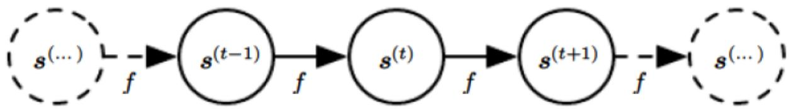

flowchart

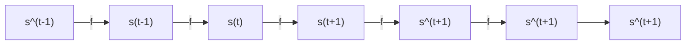
```mermaid
graph LR
    A["s^(t-1)"] -->|f| B["s(t-1)"]
    B -->|f| C["s(t)"]
    C -->|f| D["s(t+1)"]
    D -->|f| E["s^(t+1)"]
    E -->|f| F["s^(t+1)"]
    F --> G["s^(t+1)"]
```

$$
s ^ {(t + 1)} = f (s ^ {(t)}; \theta)
$$

# Computational graphs

• Dynamical system driven by external data

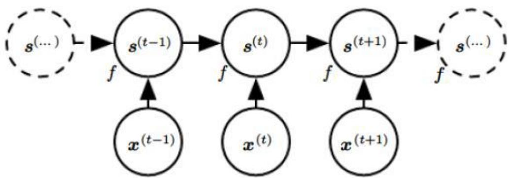

flowchart

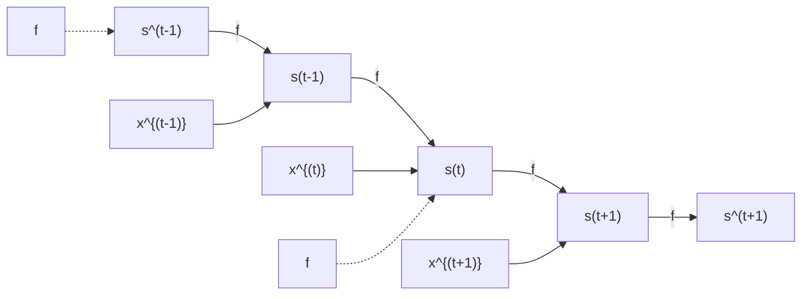
```mermaid
graph LR
    A["s^(t-1)"] -->|f| B["s(t-1)"]
    B -->|f| C["s(t)"]
    C -->|f| D["s(t+1)"]
    D -->|f| E["s^(t+1)"]
    F["x^{(t-1)}"] --> B
    G["x^{(t)}"] --> C
    H["x^{(t+1)}"] --> D
    I["f"] -.-> A
    J["f"] -.-> C
```

$$
s ^ {(t + 1)} = f (s ^ {(t)}, x ^ {(t + 1)}; \theta)
$$

# Computational graphs

# • Compact view

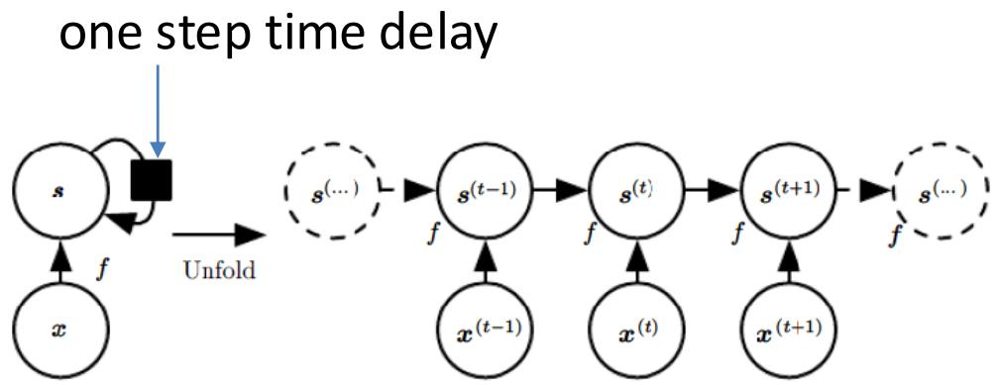

flowchart

```mermaid
graph TD
    A["x"] --> B["s"]
    B --> C["Unfold"]
    C --> D["s^(t-1)"]
    D --> E["s(t)"]
    E --> F["s(t+1)"]
    F --> G["s^(t+1)"]
    G --> H["f"]
    H --> I["x^(t-1)"]
    I --> J["x^(t)"]
    J --> K["x^(t+1)"]
    K --> L["f"]
    L --> M["x^(t+1)"]
    M --> N["f"]
    N --> O["s^(t-1)"]
    O --> P["s^(t-1)"]
    P --> Q["s^(t+1)"]
    Q --> R["f"]
    R --> S["s^(t+1)"]
    S --> T["f"]
    T --> U["s^(t+1)"]
    U --> V["f"]
    V --> W["s^(t+1)"]
    W --> X["f"]
    X --> Y["s^(t+1)"]
    Y --> Z["f"]
    Z --> AA["s^(t+1)"]
    AA --> AB["f"]
    AB --> AC["s^(t-1)"]
    AC --> AD["s^(t-1)"]
    AD --> AE["x^(t-1)"]
    AE --> AF["x^(t+1)"]
    AF --> AG["x^(t+1)"]
    AG --> AH["x^(t+1)"]
    AH --> AI["x^(t+1)"]
    AI --> AJ["f"]
    AJ --> AK["s^(t-1)"]
    AK --> AL["x^(t+1)"]
    AL --> AM["x^(t+1)"]
    AM --> AN["x^(t+1)"]
    AN --> AO["x^(t+1)"]
    AO --> AP["x^(t+1)"]
    AP --> AQ["x^(t+1)"]
    AQ --> AR["x^(t+1)"]
    AR --> AS["x^(t+1)"]
    AS --> AT["x^(t+1)"]
    AT --> AU["x^(t+1)"]
    AU --> AV["x^(t+1)"]
    AV --> AW["x^(t+1)"]
    AW --> AX["x^(t+1)"]
    AX --> AY["x^(t+1)"]
```

$$
s ^ {(t + 1)} = f (s ^ {(t)}, x ^ {(t + 1)}; \theta)
$$

The same f and ?? for all time steps

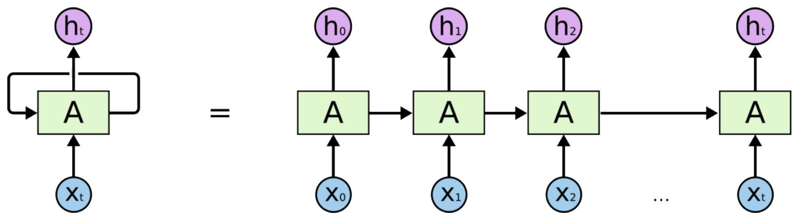

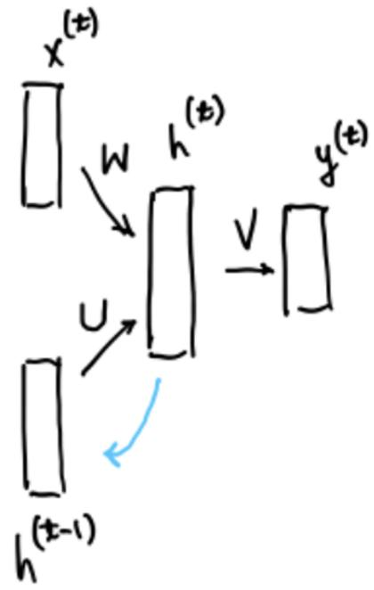

flowchart

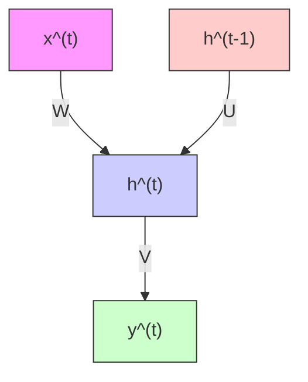
```mermaid
graph TD
    A["x^(t)"] -->|W| B["h^(t)"]
    B -->|V| C["y^(t)"]
    D["h^(t-1)"] -->|U| B
    style A fill:#f9f,stroke:#333
    style B fill:#ccf,stroke:#333
    style C fill:#cfc,stroke:#333
    style D fill:#fcc,stroke:#333
```

Suppose at the time-step t,we have the input word $x ^ { ( t ) }$ the output $y ^ { ( t ) }$ ，and the hidden layer $h ^ { ( t ) }$

$$
h ^ {(t)} = \sigma \left(U h ^ {(t - 1)} + W x ^ {(t)}\right)
$$

$$
y ^ {(t)} = \text { Softmax } (V h ^ {(t)})
$$

Training:

Standard Backprop with SGD;   
Simply treat the network as Feedforward Network with $h ^ { ( t - 1 ) }$ as an additional input.

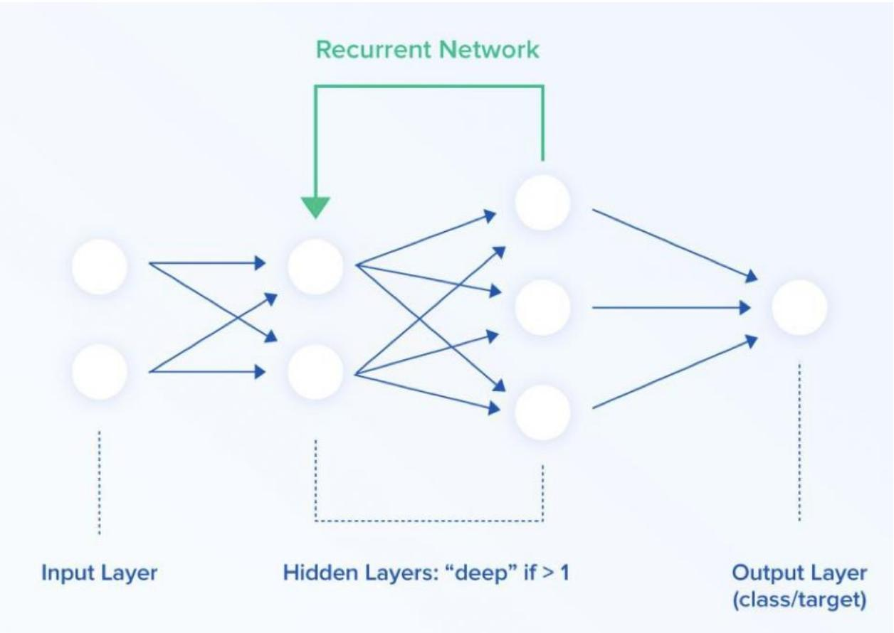

flowchart

```mermaid
graph TD
    A["Input Layer"] --> B["Hidden Layers: &quot;deep&quot; if > 1"]
    C["Input Layer"] --> B
    D["Input Layer"] --> B
    E["Input Layer"] --> B
    F["Input Layer"] --> B
    G["Input Layer"] --> B
    H["Input Layer"] --> B
    I["Input Layer"] --> B
    J["Input Layer"] --> B
    K["Input Layer"] --> B
    L["Input Layer"] --> B
    M["Input Layer"] --> B
    N["Input Layer"] --> B
    O["Input Layer"] --> B
    P["Input Layer"] --> B
    Q["Input Layer"] --> B
    R["Input Layer"] --> B
    S["Input Layer"] --> B
    T["Input Layer"] --> B
    U["Input Layer"] --> B
    V["Input Layer"] --> B
    W["Input Layer"] --> B
    X["Input Layer"] --> B
    Y["Input Layer"] --> B
    Z["Input Layer"] --> B
    AA["Input Layer"] --> B
    AB["Input Layer"] --> B
    AC["Input Layer"] --> B
    AD["Input Layer"] --> B
    AE["Input Layer"] --> B
    AF["Input Layer"] --> B
    AG["Input Layer"] --> B
    AH["Input Layer"] --> B
    AI["Input Layer"] --> B
    AJ["Input Layer"] --> B
    AK["Input Layer"] --> B
    AL["Input Layer"] --> B
    AM["Input Layer"] --> B
    AN["Input Layer"] --> B
    AO["Input Layer"] --> B
    AP["Input Layer"] --> B
    AQ["Input Layer"] --> B
    AR["Input Layer"] --> B
    AS["Input Layer"] --> B
    AT["Output Layer (class/target)"] --> AU["Output Layer"]
    AV["Output Layer"] --> AW["Output Layer"]
    AX["Output Layer"] --> AY["Output Layer"]
    AZ["Output Layer"] --> BA["Output Layer"]
    BB["Output Layer"] --> BC["Output Layer"]
    BD["Output Layer"] --> BE["Output Layer"]
    BF["Output Layer"] --> BG["Output Layer"]
```

# RNN 应用：词性标注POS（Part -Of-Speech tagging）

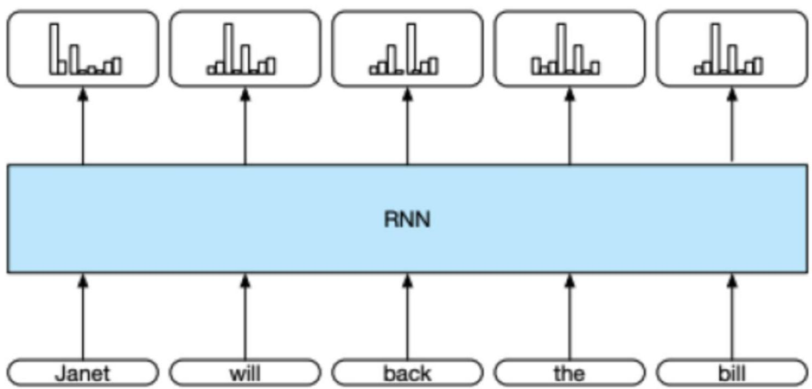

flowchart

```mermaid
graph TD
    A["Input Block 1"] --> B["RNN"]
    C["Input Block 2"] --> B
    D["Input Block 3"] --> B
    E["Input Block 4"] --> B
    F["Input Block 5"] --> B
    G["Input Block 6"] --> B
    H["Input Block 7"] --> B
    I["Input Block 8"] --> B
    J["Input Block 9"] --> B
    K["Input Block 10"] --> B
    L["Input Block 11"] --> B
    M["Input Block 12"] --> B
    N["Input Block 13"] --> B
    O["Input Block 14"] --> B
    P["Input Block 15"] --> B
    Q["Input Block 16"] --> B
    R["Input Block 17"] --> B
    S["Input Block 18"] --> B
    T["Input Block 19"] --> B
    U["Input Block 20"] --> B
    V["Input Block 21"] --> B
    W["Input Block 22"] --> B
    X["Input Block 23"] --> B
    Y["Input Block 24"] --> B
    Z["Input Block 25"] --> B
    AA["Input Block 26"] --> B
    AB["Input Block 27"] --> B
    AC["Input Block 28"] --> B
    AD["Input Block 29"] --> B
    AE["Input Block 30"] --> B
    AF["Input Block 31"] --> B
    AG["Input Block 32"] --> B
    AH["Input Block 33"] --> B
    AI["Input Block 34"] --> B
    AJ["Input Block 35"] --> B
    AK["Input Block 36"] --> B
    AL["Input Block 37"] --> B
    AM["Input Block 38"] --> B
    AN["Input Block 39"] --> B
    AO["Input Block 40"] --> B
    AP["Input Block 41"] --> B
    AQ["Input Block 42"] --> B
    AR["Input Block 43"] --> B
    AS["Input Block 44"] --> B
    AT["Input Block 45"] --> B
    AU["Input Block 46"] --> B
    AV["Input Block 47"] --> B
    AW["Input Block 48"] --> B
    AX["Input Block 49"] --> B
    AY["Output Label: Janet"]
    AZ["Output Label: will"]
    BA["Output Label: back"]
    BB["Output Label: the"]
    BC["Output Label: bill"]
```

我 爱 北京 天安门

代词r 动词v 名词ns 名词ns

# Typical RNN Architecture

?? ??????????; ?? ??????????; ?? ????????????; ?? ????????; ?? ??????????;   
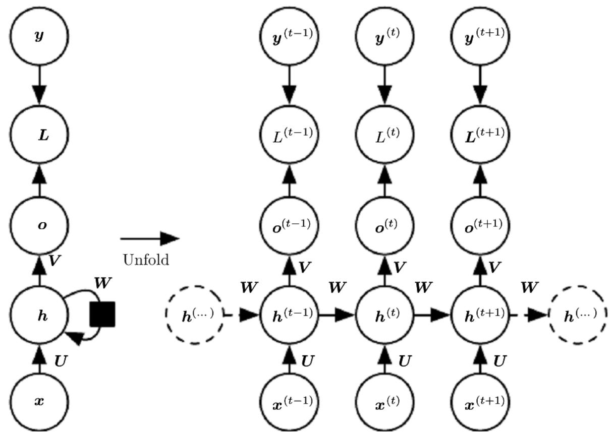

flowchart

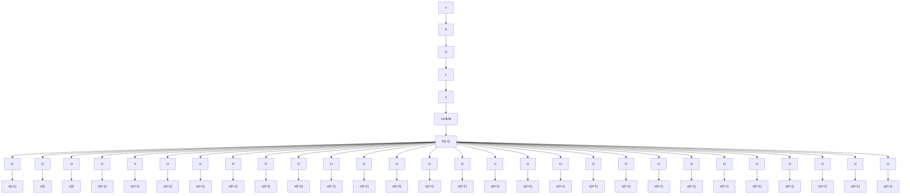
```mermaid
graph TD
    A["x"] --> B["h"]
    B --> C["O"]
    C --> D["L"]
    D --> E["y"]
    E --> F["Unfold"]
    F --> G["h(t-1)"]
    G --> H["U"]
    H --> I["x(t-1)"]
    G --> J["U"]
    J --> K["x(t)"]
    G --> L["U"]
    L --> M["x(t)"]
    G --> N["U"]
    N --> O["x(t+1)"]
    G --> P["U"]
    P --> Q["x(t+1)"]
    G --> R["U"]
    R --> S["x(t+1)"]
    G --> T["U"]
    T --> U["x(t+1)"]
    G --> V["U"]
    V --> W["x(t+1)"]
    G --> X["U"]
    X --> Y["x(t+1)"]
    G --> Z["U"]
    Z --> AA["x(t+1)"]
    G --> AB["U"]
    AB --> AC["x(t+1)"]
    G --> AD["U"]
    AD --> AE["x(t+1)"]
    G --> AF["U"]
    AF --> AG["x(t+1)"]
    G --> AH["U"]
    AH --> AI["x(t+1)"]
    G --> AJ["U"]
    AJ --> AK["x(t+1)"]
    G --> AL["U"]
    AL --> AM["x(t+1)"]
    G --> AN["U"]
    AN --> AO["x(t+1)"]
    G --> AP["U"]
    AP --> AQ["x(t+1)"]
    G --> AR["U"]
    AR --> AS["x(t+1)"]
    G --> AT["U"]
    AT --> AU["x(t+1)"]
    G --> AV["U"]
    AV --> AW["x(t+1)"]
    G --> AX["U"]
    AX --> AY["x(t+1)"]
    G --> AZ["U"]
    AZ --> BA["x(t+1)"]
    G --> BB["U"]
    BB --> BC["x(t+1)"]
    G --> BD["U"]
    BD --> BE["x(t+1)"]
    G --> BF["U"]
    BF --> BG["x(t+1)"]
    G --> BH["U"]
    BH --> BI["x(t+1)"]
    G --> BJ["U"]
    BJ --> BK["x(t+1)"]
```

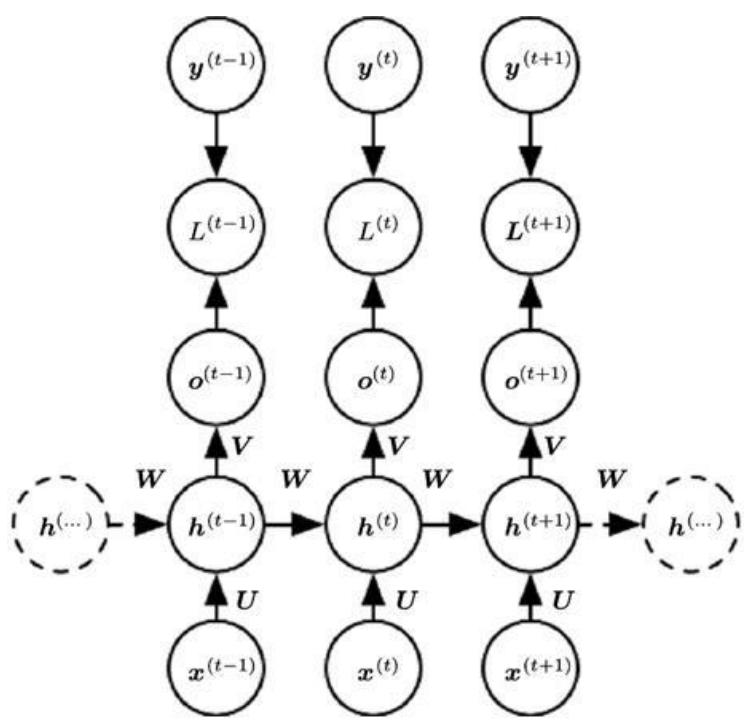

flowchart

```mermaid
graph TD
    A["y^{(t-1)"] --> L^{(t-1)}]
    B["y^{(t)"] --> L^{(t)}]
    C["y^{(t+1)} --> L^{(t+1)}"]
    D["o^{(t-1)}"] --> H["h^{(t-1)}"]
    E["o^{(t)}"] --> H
    F["o^{(t+1)}"] --> H
    G["h^{(t-1)}"] --> H
    H --> I["h^{(t)}"]
    I --> J["h^{(t+1)}"]
    K["x^{(t-1)}"] --> H
    L["x^{(t)}"] --> H
    M["x^{(t+1)}"] --> H
    N["w"] --> H
    O["U"] --> H
    P["W"] --> H
    Q["V"] --> H
    R["W"] --> H
    S["w"] --> J
    T["U"] --> J
    U["U"] --> J
    V["U"] --> J
    W["w"] --> J
    X["w"] --> J
```

$$
a ^ {(t)} = b + W h ^ {(t - 1)} + U x ^ {(t)}
$$

$$
h ^ {(t)} = \tanh (a ^ {(t)})
$$

$$
o ^ {(t)} = c + V h ^ {(t)}
$$

$$
\widehat {y} ^ {(t)} = \text {softmax} (o ^ {(t)})
$$

• RNNs consist of three blocks of parameters and associated transformations:

– From the input to the hidden state   
– From the previous hidden state to the next hidden state   
– From the hidden state to the output

• Hidden state: a lossy（有损的）summary of the past   
• Shared functions and parameters   
– Greatly reduce the capacity and good for generalization in learning   
• Explicitly use the prior knowledge that the sequential data can be processed in the same way at different time step (e.g., NLP)   
• Powerful

– Any function computable by a Turing machine can be computed by such a recurrent network of a finite size

# • Principle

– Unfold the computational graph, and use backpropagation

# • Method

– BPTT (Back-Propagation Through Time)

# • Strategy

– Fist compute the gradients of the internal nodes   
– Then compute the gradients of the parameters

flowchart

```mermaid
graph TD
    A["y^{(t-1)"] --> L^{(t-1)}]
    B["y^{(t)"] --> L^{(t)}]
    C["y^{(t+1)} --> L^{(t+1)}"]
    D["o^{(t-1)}"] --> H["h^{(t-1)}"]
    E["o^{(t)}"] --> H
    F["o^{(t+1)}"] --> H
    G["h^{(t-1)}"] --> H
    H --> I["h^{(t)}"]
    I --> J["h^{(t+1)}"]
    K["x^{(t-1)}"] --> H
    L["x^{(t)}"] --> H
    M["x^{(t+1)}"] --> H
    N["w"] --> H
    O["U"] --> H
    P["W"] --> H
    Q["V"] --> H
    R["W"] --> H
    S["U"] --> H
    T["U"] --> H
    U["w"] --> J
    V["w"] --> J
    W["h^{(t-1)}"] --> H
    X["h^{(t)}"] --> J
```

$$
a ^ {(t)} = b + W h ^ {(t - 1)} + U x ^ {(t)}
$$

$$
h ^ {(t)} = \tanh (a ^ {(t)})
$$

$$
o ^ {(t)} = c + V h ^ {(t)}
$$

$$
\widehat {y} ^ {(t)} = \text {softmax} (o ^ {(t)})
$$

# BPTT: Parameters

$$
a ^ {(t)} = b + W h ^ {(t - 1)} + U x ^ {(t)}
$$

$$
h ^ {(t)} = \tanh (a ^ {(t)})
$$

$$
o ^ {(t)} = c + V h ^ {(t)}
$$

$$
\widehat {y} ^ {(t)} = \text { softmax } (o ^ {(t)})
$$

<table><tr><td>Symbol</td><td>Meaning</td></tr><tr><td>K</td><td>The size of vocabulary (# labels)</td></tr><tr><td>T</td><td>The number of all time steps</td></tr><tr><td>H</td><td>The dimension of state (hidden layer)</td></tr><tr><td> $\boldsymbol{x}^{(t)} \in \mathfrak{R}^{N \times 1}$ </td><td>The input of the hidden layer at time t</td></tr><tr><td> $\boldsymbol{y}^{(t)} \in \mathfrak{R}^{K \times 1}$ </td><td>The true probability distribution at time t, one-hot vector</td></tr><tr><td> $\widehat{\boldsymbol{y}}^{(t)} \in \mathfrak{R}^{K \times 1}$ </td><td>The predicted probability distribution of labels at time t</td></tr><tr><td> $\boldsymbol{a}^{(t)} \in \mathfrak{R}^{H \times 1}$ </td><td>The input of the hidden layer at time t</td></tr><tr><td> $\boldsymbol{h}^{(t)} \in \mathfrak{R}^{H \times 1}$ </td><td>The value of state of the hidden layer at time t</td></tr><tr><td> $\boldsymbol{o}^{(t)} \in \mathfrak{R}^{K \times 1}$ </td><td>The output of the hidden layer at time t</td></tr><tr><td> $\boldsymbol{W} \in \mathfrak{R}^{H \times H}$ </td><td>The weight matrix of hidden-to-hidden connection</td></tr><tr><td> $\boldsymbol{U} \in \mathfrak{R}^{H \times N}$ </td><td>The weight matrix of input-to-hidden connection</td></tr><tr><td> $\boldsymbol{V} \in \mathfrak{R}^{K \times H}$ </td><td>The weight matrix of hidden-to-output connection</td></tr><tr><td> $\boldsymbol{b} \in \mathfrak{R}^{H \times 1}$  $\boldsymbol{c} \in \mathfrak{R}^{K \times 1}$ </td><td>Bias</td></tr></table>

# • The parameters need to learn

– Bias: b, c   
– weight matrix: W,U,V

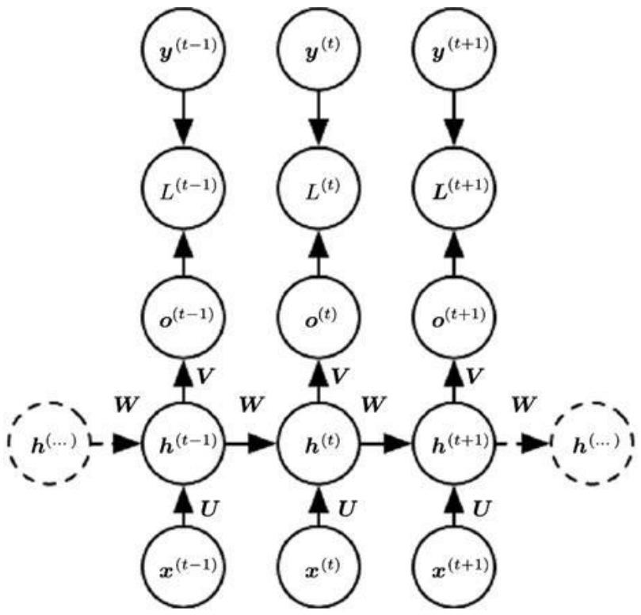

flowchart

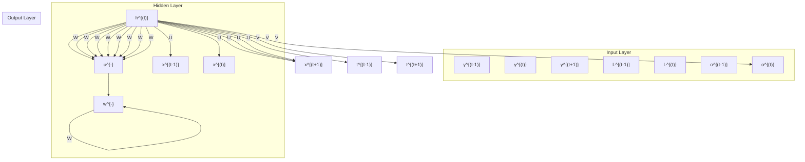
```mermaid
graph TD
    subgraph Input Layer
        y_t_minus_1["y^{(t-1)}"]
        y_t[" y^{(t)} "]
        y_t_plus_1["y^{(t+1)}"]
        L_t_minus_1["L^{(t-1)}"]
        L_t[" L^{(t)} "]
        o_t_minus_1["o^{(t-1)}"]
        o_t[" o^{(t)} "]
    end

    subgraph Hidden Layer
        h_t_minus_1["h^{(t-1)}"]
        h_t["h^{(t)}"]
        h_t_plus_1["o^{(t+1)}"]
        x_t_minus_1["x^{(t-1)}"]
        x_t["x^{(t)}"]
    end

    subgraph Output Layer
        h_t_plus_1["h^{(t+1)}"]
        h_t_plus_1 --> h_t_minus_1["w^{-}"]
        h_t --> h_t_plus_1["u^{-}"]
    end

    h_t_minus_1 -->|W| h_t_minus_1
    h_t -->|W| h_t_plus_1
    h_t -->|W| h_t_plus_1
    h_t -->|W| h_t_plus_1
    h_t -->|W| h_t_plus_1
    h_t -->|W| h_t_plus_1
    h_t -->|W| h_t_plus_1
    h_t -->|W| h_t_plus_1
    h_t -->|W| h_t_plus_1
    h_t -->|U| x_t_minus_1["x^{(t-1)}"]
    h_t -->|U| x_t["x^{(t)}"]
    h_t -->|U| x_t_plus_1["x^{(t+1)}"]
    h_t -->|U| x_t_plus_1
    h_t -->|U| x_t_plus_1
    h_t -->|V| o_t_minus_1o["t^{(t-1)}"]
    h_t -->|V| o_t[" o^{(t)} "]
    h_t -->|V| o_t_plus_1o["t^{(t+1)}"]
```

# BPTT

• Loss at time t: $\pmb { L } ^ { ( t ) }$   
• Loss function: $\begin{array} { r } { L = \sum _ { t = 1 } ^ { T } L ^ { ( t ) } } \end{array}$   
• Negative log-likelihood

转置

$$
\boldsymbol {L} ^ {(t)} = - (\boldsymbol {y} ^ {(t)}) ^ {T} \boldsymbol {l o g} ((\widehat {\boldsymbol {y}} ^ {(t)})
$$

$$
\pmb {y} ^ {(t)} = (\mathbf {0}, \dots , \mathbf {1}, \dots , \mathbf {0}) ^ {T}
$$

$$
\widehat {y} _ {i} ^ {(t)} = \frac {e ^ {o _ {i} ^ {(t)}}}{\sum_ {k = 1} ^ {K} e ^ {o _ {k} ^ {(t)}}}
$$

Use gradient descent to learn these parameters, we should calculate the gradient of L as follows

$$
\nabla_ {c} L, \nabla_ {b} L, \nabla_ {U} L, \nabla_ {W} L, \nabla_ {V} L
$$

$\frac { \partial { \cal { L } } } { \partial { \cal { L } } ^ { ( t ) } } = \frac { \partial \Bigg ( \sum _ { i = 1 } ^ { T } { \cal { L } } ^ { ( i ) } \Bigg ) } { \partial { \cal { L } } ^ { ( t ) } } = 1$ L(i） • Gradient at $L ^ { ( t ) }$

$\mathbf { \nabla } \bullet \mathsf { G r a d i e n t a t } o ^ { ( t ) } \quad \nabla _ { \mathsf { o } ^ { ( t ) } } L = ( \frac { \partial L } { \partial o _ { 1 } ^ { ( t ) } } , . . . , \frac { \partial L } { \partial o _ { i } ^ { ( t ) } } , . . . , \frac { \partial L } { \partial o _ { K } ^ { ( t ) } } )$ VoL=(

$$
\frac {\partial L}{\partial o _ {i} ^ {(t)}} = \frac {\partial L}{\partial L ^ {(t)}} \frac {\partial L ^ {(t)}}{\partial o _ {i} ^ {(t)}} = \frac {\partial L ^ {(t)}}{\partial o _ {i} ^ {(t)}}
$$

$\mathsf { G r a d i e n t a t } o ^ { ( t ) } : \qquad \nabla _ { o ^ { ( t ) } } L = ( \frac { \partial L } { \partial o _ { 1 } ^ { ( t ) } } , . . . , \frac { \partial L } { \partial o _ { i } ^ { ( t ) } } , . . . , \frac { \partial L } { \partial o _ { K } ^ { ( t ) } } )$ 0(t) 0

$$
\frac {\partial L}{\partial o _ {i} ^ {(t)}} = \frac {\partial L ^ {(t)}}{\partial o _ {i} ^ {(t)}} \xrightarrow {} L ^ {(t)} = - (y ^ {(t)}) ^ {T} \log (\hat {y} ^ {(t)}) = - \sum_ {k = 1} ^ {K} y _ {k} ^ {(t)} \log (\hat {y} _ {k} ^ {(t)})
$$

$$
= \sum_ {k = 1} ^ {K} \frac {\partial L ^ {(t)}}{\partial \widehat {y} _ {k} ^ {(t)}} \frac {\partial \widehat {y} _ {k} ^ {(t)}}{\partial o _ {i} ^ {(t)}}
$$

$$
= \frac {\partial L ^ {(t)}}{\partial \widehat {y} _ {l _ {t}} ^ {(t)}} \frac {\partial \widehat {y} _ {l _ {t}} ^ {(t)}}{\partial o _ {i} ^ {(t)}}
$$

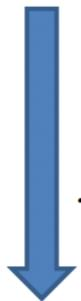

natural_image

Blue vertical arrow pointing downward (no text or symbols)

label index

$$
\begin{array}{c} 1 \ldots l _ {t} \ldots K \\ y ^ {(t)} = (0, \ldots , 1, \ldots , 0) ^ {\mathrm{T}} \end{array}
$$

$$
L ^ {(t)} = - y _ {l _ {t}} ^ {(t)} \log (\widehat {y} _ {l _ {t}} ^ {(t)}) = - \log (\widehat {y} _ {l _ {t}} ^ {(t)})
$$

Gradient at o(t) :

$$
\nabla_ {o ^ {(t)}} L = (\frac {\partial L}{\partial o _ {1} ^ {(t)}}, \dots , \frac {\partial L}{\partial o _ {i} ^ {(t)}}, \dots , \frac {\partial L}{\partial o _ {K} ^ {(t)}})
$$

$$
L ^ {(t)} = - \log (\widehat {y} _ {l _ {t}} ^ {(t)}) \Longrightarrow \frac {\partial L ^ {(t)}}{\partial \widehat {y} _ {l _ {t}} ^ {(t)}} = - \frac {1}{\widehat {y} _ {l _ {t}} ^ {(t)}}
$$

$$
\frac {\partial L}{\partial o _ {i} ^ {(t)}} = \frac {\partial L ^ {(t)}}{\partial \widehat {y} _ {l _ {t}} ^ {(t)}} \frac {\partial \widehat {y} _ {l _ {t}} ^ {(t)}}{\partial o _ {i} ^ {(t)}}
$$

$$
= \left\{ \begin{array}{c c} \widehat {y} _ {l _ {t}} ^ {(t)} - 1, & i = l _ {t} \\ \widehat {y} _ {i} ^ {(t)}, & i \neq l _ {t} \end{array} \right.
$$

$$
\begin{array}{l} \hat {y} _ {j} ^ {(t)} = \frac {e ^ {o _ {j} ^ {(t)}}}{\sum_ {k = 1} ^ {K} e ^ {o _ {k} ^ {(t)}}} \Longrightarrow \frac {\partial \hat {y} _ {j} ^ {(t)}}{\partial o _ {i} ^ {(t)}} = \left\{ \begin{array}{c c} \hat {y} _ {j} ^ {(t)} (1 - \hat {y} _ {j} ^ {(t)}), & j = i \\ - \hat {y} _ {i} ^ {(t)} \hat {y} _ {j} ^ {(t)}, & j \neq i \end{array} \right. \end{array}
$$

$$
i = j: \quad \mathrm{原式} = \frac {\partial}{\partial 0 _ {j}} \frac {e ^ {0 _ {j} (t)}}{\sum_ {k} e ^ {0 _ {k} (t)}} = \frac {e ^ {0 _ {j} (t)} \sum_ {k} e ^ {0 _ {k} t} - e ^ {0 _ {j} (t)} \cdot e ^ {0 _ {j} (t)}}{(\sum_ {k} e ^ {0 _ {k} (t)}) ^ {2}} = \frac {e ^ {0 _ {j} (t)}}{\sum_ {k} c ^ {0 _ {k} (t)}} \cdot \frac {\sum_ {k} e ^ {0 _ {k} (t)} - e ^ {0 _ {j} (t)}}{\sum_ {k} e ^ {0 _ {k} (t)}} = y _ {j} ^ {(t)} \cdot (1 - y _ {j} ^ {(t)})
$$

$$
i \neq j: \text {   原式   } = e ^ {g _ {j} ^ {(t)}} \cdot \frac {- e ^ {g _ {i} ^ {(t)}}}{(\sum_ {k} e ^ {g _ {k} ^ {(t)}}) ^ {2}} = - y _ {j} ^ {(t)} y _ {i} ^ {(t)}
$$

Gradient at $o ^ { ( t ) }$

$$
\nabla_ {o ^ {(t)}} L = \left(\frac {\partial L}{\partial o _ {1} ^ {(t)}}, \dots , \frac {\partial L}{\partial o _ {i} ^ {(t)}}, \dots , \frac {\partial L}{\partial o _ {K} ^ {(t)}}\right)
$$

# Matrix calculus

$$
\begin{array}{l} \frac {\partial L}{\partial o _ {i} ^ {(t)}} = \frac {\partial L ^ {(t)}}{\partial o _ {i} ^ {(t)}} = \sum_ {k = 1} ^ {K} \frac {\partial L ^ {(t)}}{\partial \widehat {y} _ {k} ^ {(t)}} \frac {\partial \widehat {y} _ {k} ^ {(t)}}{\partial o _ {i} ^ {(t)}} \\ = \left(\frac {\partial L ^ {(t)}}{\partial \hat {y} _ {1} ^ {(t)}}, \dots , \frac {\partial L ^ {(t)}}{\partial \hat {y} _ {K} ^ {(t)}}\right) \cdot \left(\frac {\partial \hat {y} _ {1} ^ {(t)}}{\partial o _ {i} ^ {(t)}}, \dots , \frac {\partial \hat {y} _ {K} ^ {(t)}}{\partial o _ {i} ^ {(t)}}\right) ^ {\mathrm{T}} \\ = \nabla_ {\hat {y} ^ {(t)}} L ^ {(t)} \bullet \nabla_ {o _ {i} ^ {(t)}} \hat {y} ^ {(t)} \\ = \nabla_ {\hat {y} ^ {(t)}} L ^ {(t)} \nabla_ {o _ {i} ^ {(t)}} \hat {y} ^ {(t)} \\ \end{array}
$$

T时刻隐变量h的梯度

Gradient at h(T) :

$$
\nabla_ {h ^ {(T)}} L = (\frac {\partial L}{\partial h _ {1} ^ {(T)}}, \dots , \frac {\partial L}{\partial h _ {i} ^ {(T)}}, \dots , \frac {\partial L}{\partial h _ {H} ^ {(T)}})
$$

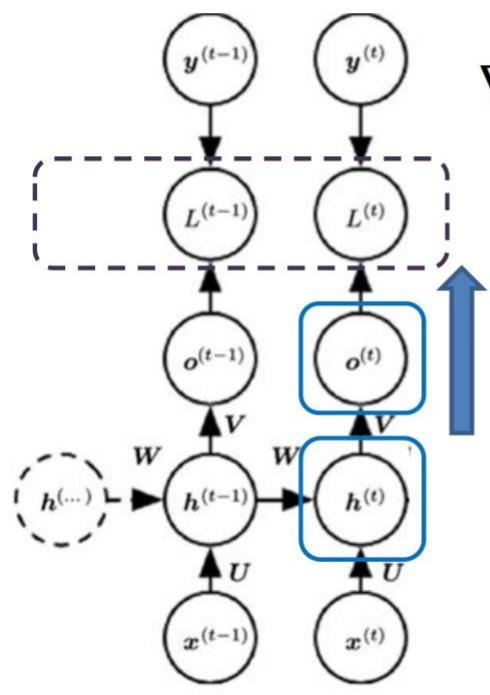

flowchart

```mermaid
graph TD
    A["y^{(t-1)"] --> L^{(t-1)}]
    B["y^{(t)} --> L^{(t)}"]
    L --> C["o^{(t-1)}"]
    C --> D["h^{(t-1)}"]
    D --> E["x^{(t-1)}"]
    D --> F["h^{(t)}"]
    G["w"] --> D
    H["U"] --> D
    I["V"] --> C
    J["W"] --> D
    K["U"] --> F
    L --> O["v"]
    O --> D
    P["O^{(t)}"] --> Q["v"]
    Q --> R["h^{(t)}"]
    R --> S["x^{(t)}"]
    R --> T["h^{(t)}"]
    U["Δ"] --> V["↑"]
    W["Δ"] --> X["↑"]
```

$$
\nabla_ {h ^ {(T)}} L = \left(\nabla_ {o ^ {(T)}} L\right) \left(\nabla_ {h ^ {(T)}} o ^ {(T)}\right)
$$

$$
= \left(\nabla_ {o ^ {(T)}} L\right) \frac {\partial o ^ {(T)}}{\partial h ^ {(T)}}
$$

$$
= (\nabla_ {o ^ {(T)}} L) V
$$

$$
\begin{array}{c} o ^ {(t)} = c + V h ^ {(t)} \\ \Biggl \downarrow \quad ? \\ \frac {\partial o ^ {(T)}}{\partial h ^ {(T)}} = V \end{array}
$$

$$
\frac {\partial o ^ {(T)}}{\partial h ^ {(T)}} \stackrel {?} {=} V
$$

$$
o ^ {(T)} = c + V h ^ {(T)} \Longrightarrow o _ {i} ^ {(T)} = c _ {i} + \sum_ {j = 1} ^ {H} V _ {i j} h _ {j} ^ {(T)} \Longrightarrow \frac {\partial o _ {i} ^ {(T)}}{\partial h _ {j} ^ {(T)}} = V _ {i j}
$$

$$
\frac {\partial o ^ {(T)}}{\partial h ^ {(T)}} = \left[ \begin{array}{c c c c c} \frac {\partial o _ {1} ^ {(T)}}{\partial h _ {1} ^ {(T)}} & \dots & \frac {\partial o _ {1} ^ {(T)}}{\partial h _ {i} ^ {(T)}} & \dots & \frac {\partial o _ {1} ^ {(T)}}{\partial h _ {H} ^ {(T)}} \\ \vdots & \vdots & \vdots & \vdots & \vdots \\ \frac {\partial o _ {i} ^ {(T)}}{\partial h _ {1} ^ {(T)}} & \dots & \frac {\partial o _ {i} ^ {(T)}}{\partial h _ {i} ^ {(T)}} & \dots & \frac {\partial o _ {i} ^ {(T)}}{\partial h _ {H} ^ {(T)}} \\ \vdots & \vdots & \vdots & \vdots & \vdots \\ \frac {\partial o _ {K} ^ {(T)}}{\partial h _ {1} ^ {(T)}} & \dots & \frac {\partial o _ {K} ^ {(T)}}{\partial h _ {i} ^ {(T)}} & \dots & \frac {\partial o _ {K} ^ {(T)}}{\partial h _ {H} ^ {(T)}} \end{array} \right] = \left[ \begin{array}{c c c c c} V _ {1 1} & \dots & V _ {1 i} & \dots & V _ {1 H} \\ \vdots & \vdots & \vdots & \vdots & \vdots \\ V _ {i 1} & \dots & V _ {i i} & \dots & V _ {i H} \\ \vdots & \vdots & \vdots & \vdots & \vdots \\ V _ {K 1} & \dots & V _ {K i} & \dots & V _ {K H} \end{array} \right] = V
$$

Gradient at h(t) :

$$
\nabla_ {h ^ {(t)}} L = \left(\frac {\partial L}{\partial h _ {1} ^ {(t)}}, \dots , \frac {\partial L}{\partial h _ {i} ^ {(t)}}, \dots , \frac {\partial L}{\partial h _ {H} ^ {(t)}}\right)
$$

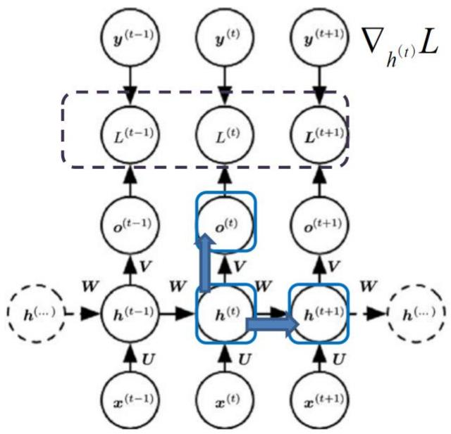

flowchart

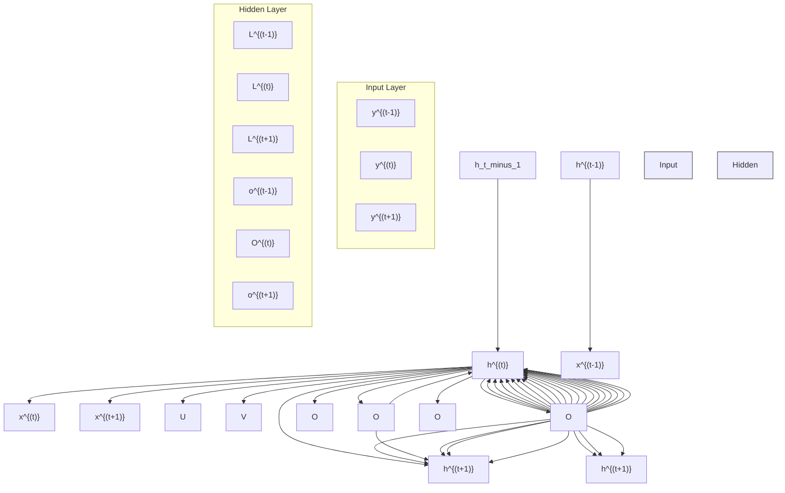
```mermaid
graph TD
    subgraph Input Layer
        y_t_minus_1["y^{(t-1)}"]
        y_t["y^{(t)}"]
        y_t_plus_1["y^{(t+1)}"]
    end

    subgraph Hidden Layer
        L_t_minus_1["L^{(t-1)}"]
        L_t["L^{(t)}"]
        L_t_plus_1["L^{(t+1)}"]
        o_t_minus_1["o^{(t-1)}"]
        o_t["O^{(t)}"]
        o_t_plus_1["o^{(t+1)}"]
    end

    h_minus_1["h^{(t-1)}"]
    h_t_minus_1 --> h_t["h^{(t)}"]
    h_t --> h_t_plus_1["h^{(t+1)}"]

    h_minus_1 --> x_t_minus_1["x^{(t-1)}"]
    h_t --> x_t["x^{(t)}"]
    h_t --> x_t_plus_1["x^{(t+1)}"]

    h_t --> U["U"]
    h_t --> V["V"]

    h_t --> v["O"]
    h_t --> w["O"]

    h_t --> v2["O"]
    h_t --> w2["O"]

    v --> h_t_plus_1
    v2 --> h_t_plus_1
    v2 --> h_t

    v --> h_t_plus_1
    v --> h_t

    v --> h_t_plus_1
    v --> h_t

    v --> h_t_plus_1
    v --> h_t

    v --> h_t

    v --> h_t

    v --> h_t

    v --> h_t

    v --> h_t

    v --> h_t

    v --> h_t

    v --> h_t

    v --> h_t

    v --> h_t

    v --> h_t

    v --> h_t

    v --> h_t

    v --> h_t

    v --> h_t

    v --> h_t

    v --> f["h^{(t+1)}"]
    v --> f
    v --> f

    style Input Layer fill:#f9f,stroke:#333
    style Hidden Layer fill:#ccf,stroke:#333
    style Input Layer fill:#cfc,stroke:#333
    style Hidden Layer fill:#fcc,stroke:#333
```

$$
\nabla_ {h ^ {(t)}} L = \left(\nabla_ {o ^ {(t)}} L\right) \left(\nabla_ {h ^ {(t)}} o ^ {(t)}\right) + \left(\nabla_ {h ^ {(t + 1)}} L\right) \left(\nabla_ {h ^ {(t)}} h ^ {(t + 1)}\right)
$$

$$
= \left(\nabla_ {o ^ {(t)}} L\right) \frac {\partial o ^ {(t)}}{\partial h ^ {(t)}} + \left(\nabla_ {h ^ {(t + 1)}} L\right) \frac {\partial h ^ {(t + 1)}}{\partial h ^ {(t)}}
$$

$$
= \left(\nabla_ {o ^ {(t)}} L\right) V + \left(\nabla_ {h ^ {(t + 1)}} L\right) \frac {\partial h ^ {(t + 1)}}{\partial h ^ {(t)}}
$$

$\mathsf { G r a d i e n t a t } \ h ^ { ( t ) } : \qquad \nabla _ { h ^ { ( t ) } } L = ( \frac { \partial L } { \partial h _ { 1 } ^ { ( t ) } } , . . . , \frac { \partial L } { \partial h _ { i } ^ { ( t ) } } , . . . , \frac { \partial L } { \partial h _ { H } ^ { ( t ) } } )$

$$
\left(\nabla_ {h ^ {(t)}} L\right) = \left(\nabla_ {o ^ {(t)}} L\right) V + \left(\nabla_ {h ^ {(t + 1)}} L\right) \frac {\partial h ^ {(t + 1)}}{\partial h ^ {(t)}}
$$

$$
a ^ {(t + 1)} = b + W h ^ {(t)} + U x ^ {(t)}; h ^ {(t + 1)} = \tanh (a ^ {(t + 1)})
$$

$$
\frac {\partial h ^ {(t + 1)}}{\partial h ^ {(t)}} = \frac {\partial h ^ {(t + 1)}}{\partial a ^ {(t + 1)}} \frac {\partial a ^ {(t + 1)}}{\partial h ^ {(t)}} = \boxed {\frac {\partial h ^ {(t + 1)}}{\partial a ^ {(t + 1)}}} W
$$

$$
(\nabla_ {h ^ {(t)}} L) = (\nabla_ {o ^ {(t)}} L) V + (\nabla_ {h ^ {(t + 1)}} L) \boxed {\frac {\partial h ^ {(t + 1)}}{\partial h ^ {(t)}}} \quad \frac {\partial h ^ {(t + 1)}}{\partial h ^ {(t)}} = \frac {\partial h ^ {(t + 1)}}{\partial a ^ {(t + 1)}} \frac {\partial a ^ {(t + 1)}}{\partial h ^ {(t)}} = \boxed {\frac {\partial h ^ {(t + 1)}}{\partial a ^ {(t + 1)}}} W
$$

$$
h ^ {(t + 1)} = (h _ {1} ^ {t + 1}, \dots , h _ {H} ^ {t + 1}); a ^ {(t + 1)} = (a _ {1} ^ {t + 1}, \dots , a _ {H} ^ {t + 1})
$$

$$
\frac {\partial h ^ {(t + 1)}}{\partial a ^ {(t + 1)}} = \left[ \begin{array}{c c c c c} \frac {\partial h _ {1} ^ {(t + 1)}}{\partial a _ {1} ^ {(t + 1)}} & \dots & \frac {\partial h _ {1} ^ {(t + 1)}}{\partial a _ {i} ^ {(t + 1)}} & \dots & \frac {\partial h _ {1} ^ {(t + 1)}}{\partial a _ {H} ^ {(t + 1)}} \\ \vdots & \vdots & \vdots & \vdots & \vdots \\ \frac {\partial h _ {i} ^ {(t + 1)}}{\partial a _ {1} ^ {(t + 1)}} & \dots & \frac {\partial h _ {i} ^ {(t + 1)}}{\partial a _ {i} ^ {(t + 1)}} & \dots & \frac {\partial h _ {i} ^ {(t + 1)}}{\partial a _ {H} ^ {(t + 1)}} \\ \vdots & \vdots & \vdots & \vdots & \vdots \\ \frac {\partial h _ {H} ^ {(t + 1)}}{\partial a _ {1} ^ {(t + 1)}} & \dots & \frac {\partial h _ {H} ^ {(t + 1)}}{\partial a _ {i} ^ {(t + 1)}} & \dots & \frac {\partial h _ {H} ^ {(t + 1)}}{\partial a _ {H} ^ {(t + 1)}} \end{array} \right]
$$

$$
h ^ {(t + 1)} = \tanh (a ^ {(t + 1)}) \Longrightarrow h _ {i} ^ {(t + 1)} = \tanh (a _ {i} ^ {(t + 1)}) = \frac {e ^ {a _ {i} ^ {(t + 1)}} - e ^ {- a _ {i} ^ {(t + 1)}}}{e ^ {a _ {i} ^ {(t + 1)}} + e ^ {- a _ {i} ^ {(t + 1)}}}
$$

$$
\frac {\partial h _ {i} ^ {(t + 1)}}{\partial a _ {i} ^ {(t + 1)}} = \mathbf {1} - \left(h _ {i} ^ {(t + 1)}\right) ^ {2} \quad \frac {\partial h _ {i} ^ {(t + 1)}}{\partial a _ {j} ^ {(t + 1)}} = \mathbf {0}; \quad j \neq i
$$

$$
\frac {\partial h ^ {(t + 1)}}{\partial a ^ {(t + 1)}} = \left[ \begin{array}{c c c c c} \frac {\partial h _ {1} ^ {(t + 1)}}{\partial a _ {1} ^ {(t + 1)}} & \dots & \frac {\partial h _ {1} ^ {(t + 1)}}{\partial a _ {i} ^ {(t + 1)}} & \dots & \frac {\partial h _ {1} ^ {(t + 1)}}{\partial a _ {H} ^ {(t + 1)}} \\ \vdots & \vdots & \vdots & \vdots & \vdots \\ \frac {\partial h _ {i} ^ {(t + 1)}}{\partial a _ {1} ^ {(t + 1)}} & \dots & \frac {\partial h _ {i} ^ {(t + 1)}}{\partial a _ {i} ^ {(t + 1)}} & \dots & \frac {\partial h _ {i} ^ {(t + 1)}}{\partial a _ {H} ^ {(t + 1)}} \\ \vdots & \vdots & \vdots & \vdots & \vdots \\ \frac {\partial h _ {H} ^ {(t + 1)}}{\partial a _ {1} ^ {(t + 1)}} & \dots & \frac {\partial h _ {H} ^ {(t + 1)}}{\partial a _ {i} ^ {(t + 1)}} & \dots & \frac {\partial h _ {H} ^ {(t + 1)}}{\partial a _ {H} ^ {(t + 1)}} \end{array} \right] \Longrightarrow
$$

$$
\frac {\partial h ^ {(t + 1)}}{\partial a ^ {(t + 1)}} = \left[ \begin{array}{c c c c c} 1 - \left(h _ {1} ^ {(t + 1)}\right) ^ {2} & \dots & 0 & \dots & 0 \\ \vdots & \vdots & \vdots & \vdots & \vdots \\ 0 & \dots & 1 - \left(h _ {i} ^ {(t + 1)}\right) ^ {2} & \dots & 0 \\ \vdots & \vdots & \vdots & \vdots & \vdots \\ 0 & \dots & 0 & \dots & 1 - \left(h _ {H} ^ {(t + 1)}\right) ^ {2} \end{array} \right]
$$

denoted as

$$
\operatorname{diag} \left(1 - \left(h ^ {(t + 1)}\right) ^ {2}\right)
$$

Gradient at $h ^ { ( t ) }$ $\nabla _ { \mu ^ { ( t ) } } L = ( \frac { \hat { \partial } L } { \hat { \partial } h _ { 1 } ^ { ( t ) } } , . . . , \frac { \hat { \partial } L } { \hat { \partial } h _ { i } ^ { ( t ) } } , . . . , \frac { \hat { \partial } L } { \hat { \partial } h _ { H } ^ { ( t ) } } )$ VL=(

$$
\left(\nabla_ {h ^ {(t)}} L\right) = \left(\nabla_ {o ^ {(t)}} L\right) V + \left(\nabla_ {h ^ {(t + 1)}} L\right) \frac {\partial h ^ {(t + 1)}}{\partial h ^ {(t)}}
$$

$$
\frac {\partial h ^ {(t + 1)}}{\partial h ^ {(t)}} = \frac {\partial h ^ {(t + 1)}}{\partial a ^ {(t + 1)}} \frac {\partial a ^ {(t + 1)}}{\partial h ^ {(t)}} = \boxed {\frac {\partial h ^ {(t + 1)}}{\partial a ^ {(t + 1)}}} W \quad \frac {\partial h ^ {(t + 1)}}{\partial a ^ {(t + 1)}} = \boxed {d i a g \left(1 - \left(h ^ {(t + 1)}\right) ^ {2}\right)}
$$

$$
\boxed {(\nabla_ {h ^ {(t)}} L) = (\nabla_ {o ^ {(t)}} L) V + (\nabla_ {h ^ {(t + 1)}} L) d i a g \left(1 - \left(h ^ {(t + 1)}\right) ^ {2}\right) W} \text {Backpropagation}
$$

Gradient at c : $\nabla _ { \boldsymbol { c } } L = ( \frac { \partial L } { \partial c _ { 1 } } , . . . , \frac { \partial L } { \partial c _ { i } } , . . . , \frac { \partial L } { \partial c _ { \boldsymbol { \kappa } } } )$

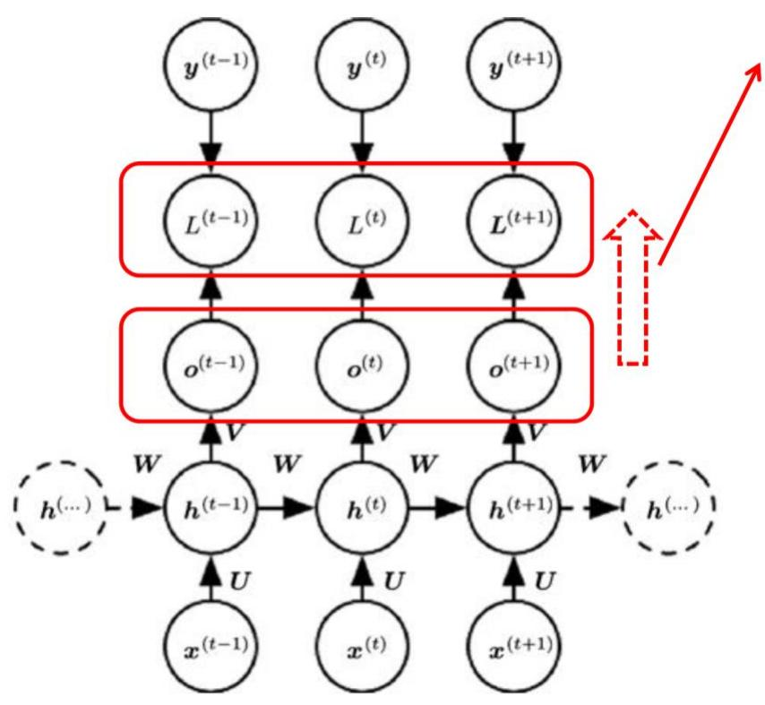

flowchart

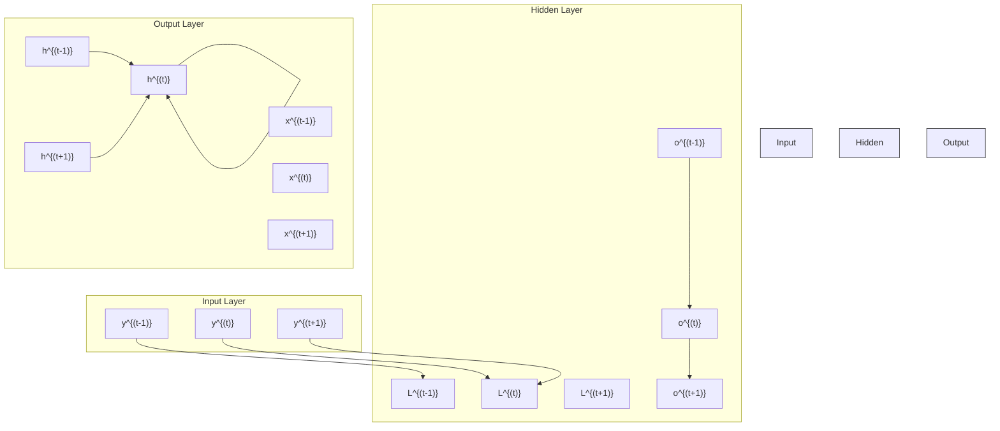
```mermaid
graph TD
    subgraph Input Layer
        y_t_minus_1["y^{(t-1)}"]
        y_t["y^{(t)}"]
        y_t_plus_1["y^{(t+1)}"]
    end

    subgraph Hidden Layer
        L_t_minus_1["L^{(t-1)}"]
        L_t["L^{(t)}"]
        L_t_plus_1["L^{(t+1)}"]
        o_t_minus_1["o^{(t-1)}"]
        o_t["o^{(t)}"]
        o_t_plus_1["o^{(t+1)}"]
    end

    subgraph Output Layer
        h_t_minus_1["h^{(t-1)}"]
        h_t["h^{(t)}"]
        h_t_plus_1["h^{(t+1)}"]
        x_t_minus_1["x^{(t-1)}"]
        x_t["x^{(t)}"]
        x_t_plus_1["x^{(t+1)}"]
    end

    y_t_minus_1 --> L_t_minus_1
    y_t --> L_t
    y_t_plus_1 --> L_t
    o_t_minus_1 --> o_t
    o_t --> o_t_plus_1
    h_t_minus_1 --> h_t
    h_t --> h_t
    h_t_plus_1 --> h_t
    style Input Layer fill:#f9f,stroke:#333
    style Hidden Layer fill:#ccf,stroke:#333
    style Output Layer fill:#cfc,stroke:#333
```

$$
c \Rightarrow o ^ {(t)} \Rightarrow L
$$

$$
o ^ {(t)} = c + V h ^ {(t)}
$$

$$
\nabla_ {c} L = \sum_ {t = 1} ^ {T} (\nabla_ {o ^ {(t)}} L) (\nabla_ {c} o ^ {(t)})
$$

$$
= \sum_ {t = 1} ^ {T} \left(\nabla_ {o ^ {(t)}} L\right) \frac {\partial o ^ {(t)}}{\partial c}
$$

$$
o ^ {(t)} = c + V h ^ {(t)} \Longrightarrow o _ {i} ^ {(t)} = c _ {i} + \sum_ {k = 1} ^ {K} V _ {i k} h _ {k} ^ {(t)} \Longrightarrow \frac {\partial o _ {i} ^ {(t)}}{\partial c _ {j}} = \left\{ \begin{array}{l l} 1, & i = j \\ 0, & i \neq j \end{array} \right.
$$

$$
\frac {\partial o ^ {(t)}}{\partial c} = \left[ \begin{array}{c c c c c} \frac {\partial o _ {1} ^ {(t)}}{\partial c _ {1}} & \dots & \frac {\partial o _ {1} ^ {(t)}}{\partial c _ {i}} & \dots & \frac {\partial o _ {1} ^ {(t)}}{\partial c _ {K}} \\ \vdots & \vdots & \vdots & \vdots & \vdots \\ \frac {\partial o _ {i} ^ {(t)}}{\partial c _ {1}} & \dots & \frac {\partial o _ {i} ^ {(t)}}{\partial c _ {i}} & \dots & \frac {\partial o _ {i} ^ {(t)}}{\partial c _ {K}} \\ \vdots & \vdots & \vdots & \vdots & \vdots \\ \frac {\partial o _ {K} ^ {(t)}}{\partial c _ {1}} & \dots & \frac {\partial o _ {K} ^ {(t)}}{\partial c _ {i}} & \dots & \frac {\partial o _ {K} ^ {(t)}}{\partial c _ {K}} \end{array} \right] \Longrightarrow \frac {\partial o ^ {(t)}}{\partial c} = \left[ \begin{array}{c c c c c} 1 & \dots & 0 & \dots & 0 \\ \vdots & \vdots & \vdots & \vdots & \vdots \\ 0 & \dots & 1 & \dots & 0 \\ \vdots & \vdots & \vdots & \vdots & \vdots \\ 0 & \dots & 0 & \dots & 1 \end{array} \right] = I
$$

$$
\nabla_ {c} L = \sum_ {t = 1} ^ {T} (\nabla_ {o ^ {(t)}} L) \frac {\partial o ^ {(t)}}{\partial c} = \sum_ {t = 1} ^ {T} (\nabla_ {o ^ {(t)}} L)
$$

Gradient at b $\nabla _ { \boldsymbol { b } } L = ( \frac { \partial L } { \partial b _ { \scriptscriptstyle 1 } } , . . . , \frac { \partial L } { \partial b _ { \scriptscriptstyle i } } , . . . , \frac { \partial L } { \partial b _ { \scriptscriptstyle H } } )$ abH

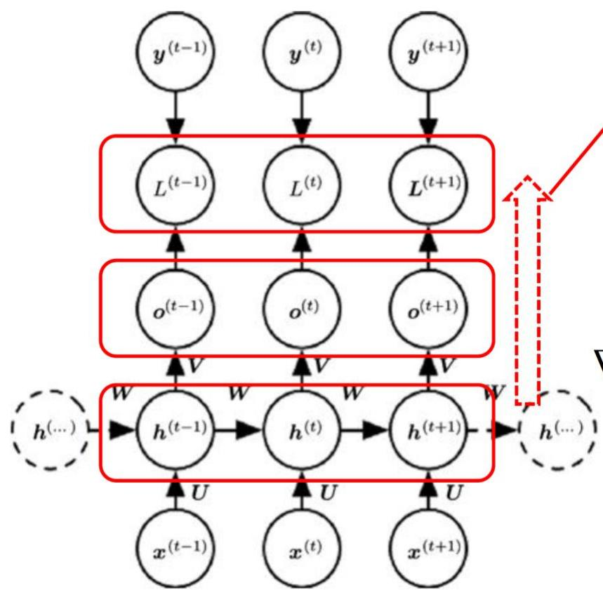

flowchart

```mermaid
graph TD
    A["y^{(t-1)"] --> L^{(t-1)}]
    B["y^{(t)} --> L^{(t)}"]
    C["y^{(t+1)} --> L^{(t+1)}"]
    D["o^{(t-1)}"] --> V
    E["o^{(t)}"] --> V
    F["o^{(t+1)}"] --> V
    G["h^{(t-1)}"] --> H["h^{(t)}"]
    I["x^{(t-1)}"] --> J["x^{(t)}"]
    K["x^{(t+1)}"] --> L["x^{(t+1)}"]
    L --> M["h^{(t+1)}"]
    N["w"] --> O["w"]
    P["U"] --> Q["U"]
    R["Δh^{(t-1)}} --> S[Δh^{(t-1)}"]
    T["Δh^{(t-1)}"] --> U["Δh^{(t-1)}"]
    V["V"] --> W["V"]
    V --> X["V"]
    Y["W"] --> Z["W"]
    Z --> AA["W"]
    AB["U"] --> AC["U"]
    AD["U"] --> AE["U"]
    AF["U"] --> AG["U"]
    AH["Δh^{(t-1)}} --> AI[h^{(t-1)}"]
    AJ["Δh^{(t-1)}"] --> AK["h^{(t)}"]
    AL["Δh^{(t-1)}"] --> AM["h^{(t+1)}"]
```

$$
b \Rightarrow a ^ {(t)} \Rightarrow h ^ {(t)} \Rightarrow L
$$

$$
a ^ {(t)} = b + W h ^ {(t - 1)} + U x ^ {(t)}
$$

$$
h ^ {(t)} = \tanh (a ^ {(t)})
$$

$$
\nabla_ {b} L = \sum_ {t = 1} ^ {T} (\nabla_ {h ^ {(t)}} L) (\nabla_ {a ^ {(t)}} h ^ {(t)}) (\nabla_ {b} a ^ {(t)})
$$

$$
a ^ {(t)} = b + W h ^ {(t - 1)} + U x ^ {(t)}
$$

$$
h ^ {(t)} = \tanh (a ^ {(t)})
$$

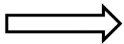

$$
\nabla_ {a ^ {(t)}} h ^ {(t)} = \operatorname{diag} \left(1 - \left(h ^ {(t)}\right) ^ {2}\right)
$$

$$
\nabla_ {b} \boldsymbol {a} ^ {(t)} = \mathbf {I}
$$

$$
\nabla_ {b} L = \sum_ {t = 1} ^ {T} (\nabla_ {h ^ {(t)}} L) (\nabla_ {a ^ {(t)}} h ^ {(t)}) (\nabla_ {b} a ^ {(t)})
$$

$$
= \sum_ {t = 1} ^ {T} (\nabla_ {h ^ {(t)}} L) d i a g \left(1 - \left(h ^ {(t)}\right) ^ {2}\right) \mathbb {I}
$$

$$
= \sum_ {t = 1} ^ {T} (\nabla_ {h ^ {(t)}} L) d i a g \left(1 - \left(h ^ {(t)}\right) ^ {2}\right)
$$

# BPTT

Gradient at V $\nabla _ { \boldsymbol { \nu } } L = \left[ \frac { \partial L } { \partial V _ { i j } } \right] _ { K \times H }$

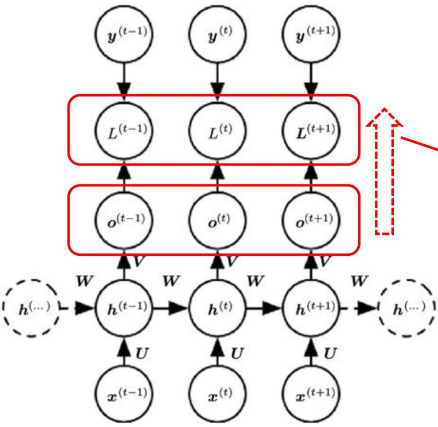

flowchart

```mermaid
graph TD
    A["y^{(t-1)"] --> L^{(t-1)}]
    B["y^{(t)} --> L^{(t)}"]
    C["y^{(t+1)} --> L^{(t+1)}"]
    D["o^{(t-1)}"] --> H["h^{(t-1)}"]
    E["o^{(t)}"] --> H
    I["o^{(t+1)}"] --> H
    H --> J["h^{(t)}"]
    K["x^{(t-1)}"] --> J
    L["x^{(t)}"] --> J
    M["x^{(t+1)}"] --> J
    N["w"] --> H
    O["U"] --> J
    P["↑"] --> Q["↑"]
    R["↓"] --> S["↓"]
    T["w"] --> J
    U["U"] --> J
    V["w"] --> J
    W["u"] --> J
    X["u"] --> J
    Y["u"] --> J
    Z["h^{(t+1)}"] --> J
    style A fill:#fff,stroke:#000
    style B fill:#fff,stroke:#000
    style C fill:#fff,stroke:#000
    style D fill:#fff,stroke:#000
    style E fill:#fff,stroke:#000
    style F fill:#fff,stroke:#000
    style G fill:#fff,stroke:#000
    style H fill:#fff,stroke:#000
    style I fill:#fff,stroke:#000
    style J fill:#fff,stroke:#000
    style K fill:#fff,stroke:#000
    style L fill:#fff,stroke:#000
    style M fill:#fff,stroke:#000
    style N fill:#fff,stroke:#000
    style O fill:#fff,stroke:#000
    style P fill:#fff,stroke:#000
    style Q fill:#fff,stroke:#000
    style R fill:#fff,stroke:#000
    style S fill:#fff,stroke:#000
    style T fill:#fff,stroke:#000
    style U fill:#fff,stroke:#000
    style V fill:#fff,stroke:#000
    style W fill:#fff,stroke:#000
    style X fill:#fff,stroke:#000
    style Y fill:#fff,stroke:#000
    style Z fill:#fff,stroke:#000
```

$$
o ^ {(t)} = c + V h ^ {(t)}
$$

$$
V \Rightarrow o ^ {(t)} \Rightarrow L
$$

$$
\frac {\partial L}{\partial V _ {i j}} = \sum_ {t = 1} ^ {T} (\nabla_ {o ^ {(t)}} L) (\nabla_ {V _ {i j}} o ^ {(t)})
$$

$$
o ^ {(t)} = c + V h ^ {(t)} \Longrightarrow o _ {s} ^ {(t)} = c _ {s} + \sum_ {k = 1} ^ {H} V _ {s k} h _ {k} ^ {(t)} \Longrightarrow \frac {\partial o _ {s} ^ {(t)}}{\partial V _ {i j}} = \left\{ \begin{array}{l l} h _ {j} ^ {(t)}, & s = i \\ 0, & s \neq i \end{array} \right.
$$

$$
\nabla_ {V _ {i j}} \boldsymbol {o} ^ {(t)} = \left(0, \dots , h _ {j} ^ {t}, \dots , 0\right) ^ {\mathrm{T}}
$$

$$
\frac {\partial L}{\partial V _ {i j}} = \sum_ {t = 1} ^ {T} (\nabla_ {o ^ {(t)}} L) (\nabla_ {V _ {i j}} o ^ {(t)})
$$

# BPTT BPT

Gradient at W VwL : $W \ \nabla _ { \scriptscriptstyle W } L = \left[ \frac { \partial L } { \partial W _ { \scriptscriptstyle i j } } \right] _ { H \times H }$ W

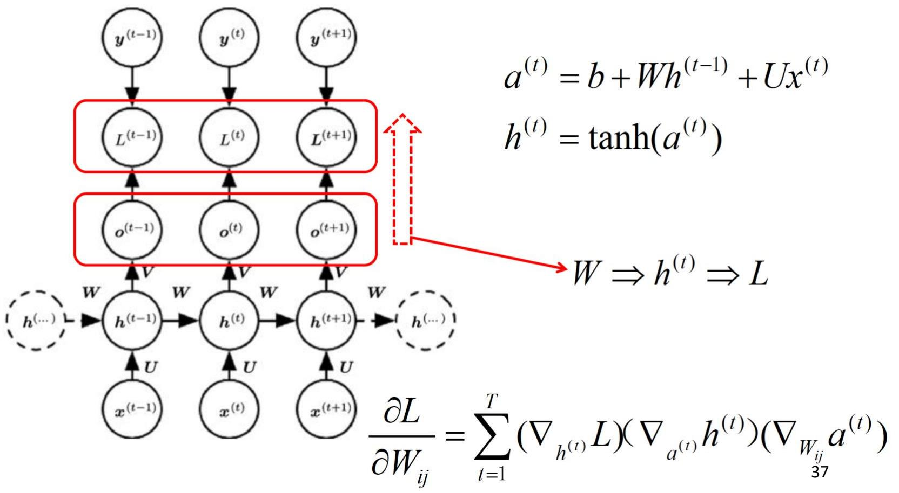

flowchart

```mermaid
graph TD
    subgraph Input Layer
        y1["y^(t-1)"] --> L1["L^(t-1)"]
        y2["y^(t)"] --> L2["L^(t)"]
        y3["y^(t+1)"] --> L3["L^(t+1)"]
    end

    subgraph Hidden Layer
        o1["o^(t-1)"] --> h1["h^(t-1)"]
        o2["o^(t)"] --> h2["h^(t)"]
        o3["o^(t+1)"] --> h3["h^(t+1)"]
    end

    subgraph Output Layer
        h1 --> U1["x^(t-1)"]
        h2 --> U2["x^(t)"]
        h3 --> U3["x^(t+1)"]
    end

    L1 --> O1
    L2 --> O2
    L3 --> O3

    style Input Layer fill:#f9f,stroke:#333
    style Hidden Layer fill:#ccf,stroke:#333
    style Output Layer fill:#cfc,stroke:#333

    note right of H
        a^T(t) = b + Wh^{(t-1)} + Ux^T
        h^T(t) = tanh(a^T)
    end

    note right of H
        W ⇒ h^T ⇒ L
    end

    subgraph Output Layer
        h1 --> U4["U"]
        h2 --> U5["U"]
        h3 --> U6["U"]
        h1 --> U7["x^(t-1)"]
        h2 --> U8["x^(t)"]
        h3 --> U9["x^(t+1)"]
        h1 --> UU["U"]
        h2 --> UV["U"]
        h3 --> UW["U"]
        h1 --> UX["x^(t-1)"]
        h2 --> UY["x^(t)"]
        h3 --> UZ["x^(t+1)"]
        h1 --> UY
        h2 --> UZ
        h1 --> UX
        h2 --> UY
        h3 --> UZ
    end

    Note right of Output Layer
        ∂L/∂W_ij = Σ_{t=1}^T (∇_h^(t)L)(∇_a^(t)h^(t))(∇_W_ij_a^(t))
    end
```

$$
h ^ {(t)} = \tanh (a ^ {(t)}) \quad \Longrightarrow \quad \nabla_ {a ^ {(t)}} h ^ {(t)} = d i a g \left(1 - \left(h ^ {(t)}\right) ^ {2}\right)
$$

$$
\frac {\partial L}{\partial W _ {i j}} = \sum_ {t = 1} ^ {T} (\nabla_ {h ^ {(t)}} L) (\nabla_ {a ^ {(t)}} h ^ {(t)}) (\nabla_ {W _ {i j}} a ^ {(t)})
$$

$$
= \sum_ {t = 1} ^ {T} (\nabla_ {h ^ {(t)}} L) d i a g (1 - (h ^ {(t)}) ^ {2}) (\nabla_ {W _ {i j}} a ^ {(t)})
$$

$$
\begin{array}{c} a ^ {(t)} = b + W h ^ {(t - 1)} + U x ^ {(t)} \\ \biguplus \\ a _ {s} ^ {(t)} = b _ {s} + \sum_ {k = 1} ^ {H} W _ {s k} h _ {k} ^ {(t - 1)} + \sum_ {k = 1} ^ {N} U _ {s k} x _ {k} ^ {(t)} \quad \Longrightarrow \frac {\partial a _ {s} ^ {(t)}}{\partial W _ {i j}} = \left\{ \begin{array}{c c} h _ {j} ^ {(t - 1)}, & s = i \\ 0, & s \neq i \end{array} \right. \end{array}
$$

$$
\nabla_ {W _ {i j}} \boldsymbol {a} ^ {(t)} = \left(0, \dots , h _ {j} ^ {(t - 1)}, \dots , 0\right) ^ {\mathrm{T}}
$$

$$
\frac {\partial L}{\partial W _ {i j}} = \sum_ {t = 1} ^ {T} (\nabla_ {h ^ {(t)}} L) d i a g \Big (1 - \Big (h ^ {(t)} \Big) ^ {2} \Big) (\nabla_ {W _ {i j}} a ^ {(t)})
$$

# BPTT

Gradient at U $\nabla _ { \boldsymbol { U } } L = \left[ \frac { \partial L } { \partial U _ { i j } } \right] _ { H \times N }$

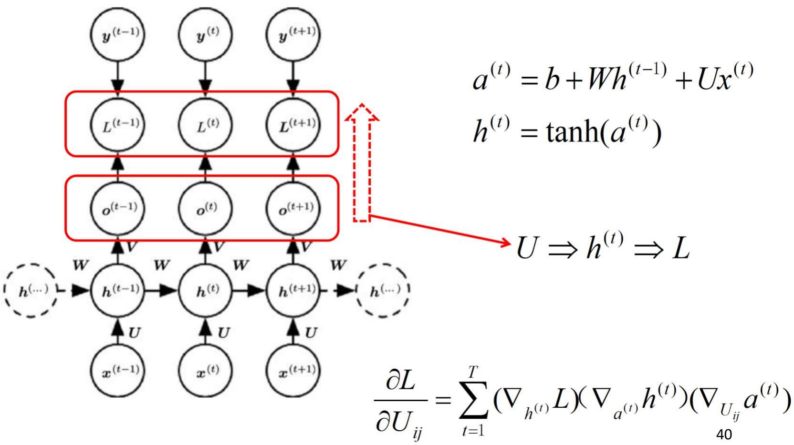

flowchart

```mermaid
graph TD
    subgraph Input Layer
        y_t_minus_1["y^{(t-1)}"]
        y_t["y^{(t)}"]
        y_t_plus_1["y^{(t+1)}"]
        L_t_minus_1["L^{(t-1)}"]
        L_t["L^{(t)}"]
        L_t_plus_1["L^{(t+1)}"]
    end

    subgraph Hidden Layer
        o_t_minus_1["o^{(t-1)}"]
        o_t["O^{(t)}"]
        o_t_plus_1["o^{(t+1)}"]
    end

    subgraph Output Layer
        h_minus_1["h^{(t-1)}"]
        h_t["h^{(t)}"]
        h_t_plus_1["h^{(t+1)}"]
        x_t["x^{(t-1)}"]
        x_t["u"]
        x_t_plus_1["x^{(t+1)}"]
    end

    y_t_minus_1 --> L_t_minus_1
    y_t --> L_t
    y_t_plus_1 --> L_t_plus_1

    L_t_minus_1 --> o_t_minus_1
    L_t --> o_t
    L_t_plus_1 --> o_t
    o_t --> v
    o_t_plus_1 --> v

    h_minus_1 --> h_t_minus_1
    h_t --> h_t
    h_t_plus_1 --> h_t
    h_t --> h_t_plus_1

    h_t --> h_minus_1
    h_t --> h_t
    h_t_plus_1 --> h_t

    h_t --> h_t_plus_1

    h_t --> h_t_plus_1

    h_t --> h_t

    style Input Layer fill:#f9f,stroke:#333
    style Hidden Layer fill:#ccf,stroke:#333
    style Output Layer fill:#cfc,stroke:#333

    note right of Input Layer: a^(t) = b + Wh^(t-1) + Ux^(t)
    note right of Hidden Layer: h^(t) = tanh(a^(t))

    note right of Output Layer: U ⇒ h^(t) ⇒ L

    note right of Output Layer: ∂L/∂U_ij = Σ_{t=1}^T (∇h^(t)L)(∇a^(t)h^(t))(∇U_ij a^(t))
    note right of Output Layer: h(t) ⇒ h^(t) ⇒ L
```

$$
h ^ {(t)} = \tanh (a ^ {(t)}) \quad \Longrightarrow \quad \nabla_ {a ^ {(t)}} h ^ {(t)} = d i a g \left(1 - \left(h ^ {(t)}\right) ^ {2}\right)
$$

$$
\frac {\partial L}{\partial U _ {i j}} = \sum_ {t = 1} ^ {T} (\nabla_ {h ^ {(t)}} L) (\nabla_ {a ^ {(t)}} h ^ {(t)}) (\nabla_ {U _ {i j}} a ^ {(t)})
$$

$$
= \sum_ {t = 1} ^ {T} (\nabla_ {h ^ {(t)}} L) d i a g (1 - (h ^ {(t)}) ^ {2}) (\nabla_ {U _ {i j}} a ^ {(t)})
$$

$$
\begin{array}{c} a ^ {(t)} = b + W h ^ {(t - 1)} + U x ^ {(t)} \\ \biguplus \\ a _ {s} ^ {(t)} = b _ {s} + \sum_ {k = 1} ^ {H} W _ {s k} h _ {k} ^ {(t - 1)} + \sum_ {k = 1} ^ {N} U _ {s k} x _ {k} ^ {(t)} \quad \Longrightarrow \frac {\partial a _ {s} ^ {(t)}}{\partial U _ {i j}} = \left\{ \begin{array}{l l} x _ {j} ^ {(t)}, & s = i \\ 0, & s \neq i \end{array} \right. \end{array}
$$

$$
\nabla_ {U _ {i j}} \boldsymbol {a} ^ {(t)} = \left(0, \dots , x _ {j} ^ {(t)}, \dots , 0\right) ^ {\mathrm{T}}
$$

$$
\frac {\partial L}{\partial U _ {i j}} = \sum_ {t = 1} ^ {T} (\nabla_ {h ^ {(t)}} L) d i a g \Big (1 - \Big (h ^ {(t)} \Big) ^ {2} \Big) (\nabla_ {U _ {i j}} a ^ {(t)})
$$

# Other Important Architectures

Recurrent networks with recurrent connections between hidden units, that read an entire sequence and then produce a single output

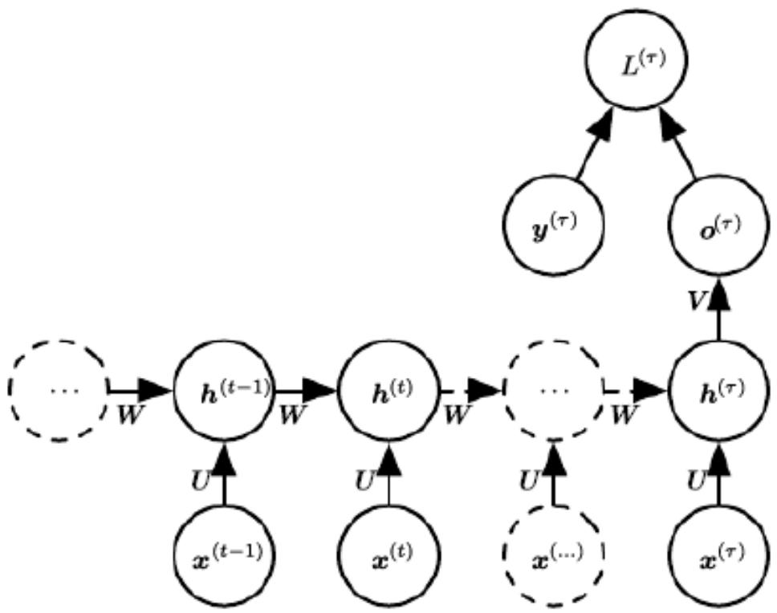

flowchart

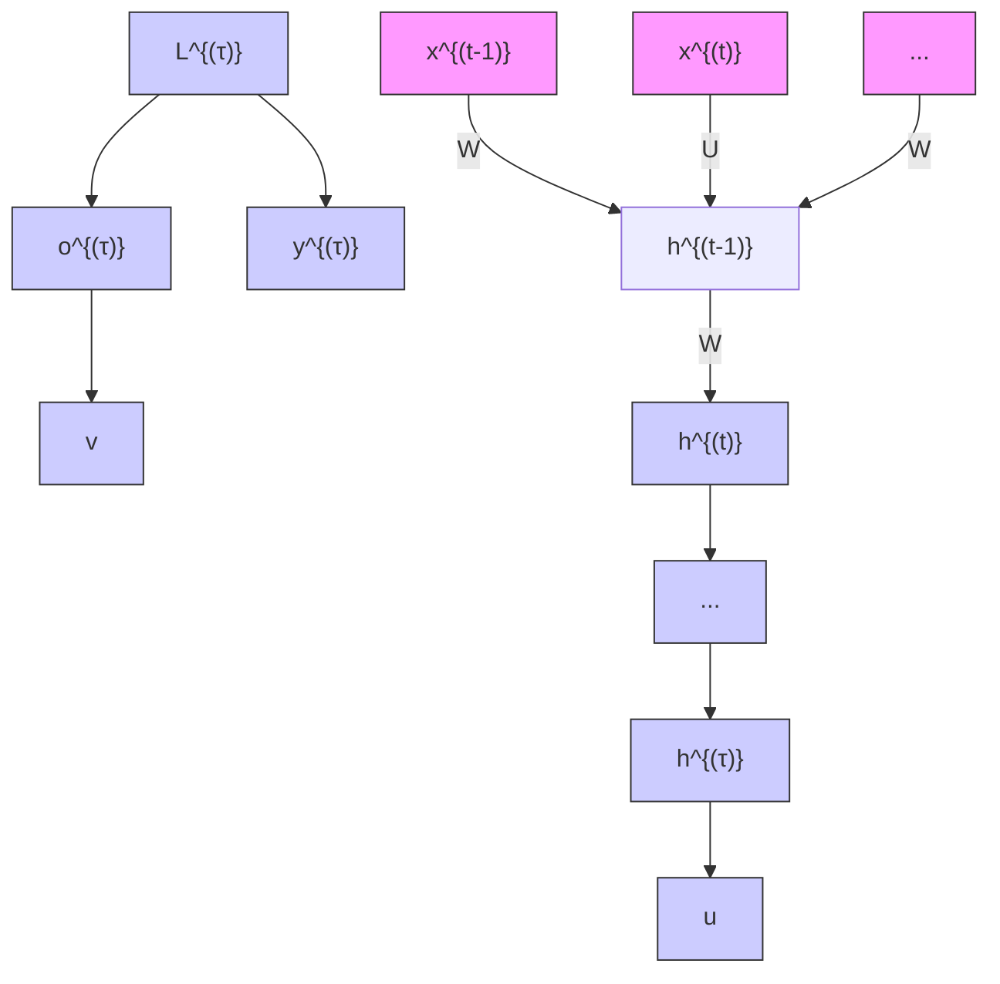
```mermaid
graph TD
    A["x^{(t-1)}"] -->|W| B["h^{(t-1)}"]
    C["x^{(t)}"] -->|U| B
    D["..."] -->|W| B
    E["L^{(τ)}"] --> F["y^{(τ)}"]
    E --> G["o^{(τ)}"]
    G --> H["v"]
    B -->|W| I["h^{(t)}"]
    I --> J["..."]
    J --> K["h^{(τ)}"]
    K --> L["u"]
    style A fill:#f9f,stroke:#333
    style C fill:#f9f,stroke:#333
    style D fill:#f9f,stroke:#333
    style E fill:#ccf,stroke:#333
    style F fill:#ccf,stroke:#333
    style G fill:#ccf,stroke:#333
    style H fill:#ccf,stroke:#333
    style I fill:#ccf,stroke:#333
    style J fill:#ccf,stroke:#333
    style K fill:#ccf,stroke:#333
    style L fill:#ccf,stroke:#333
```

# RNN 分类

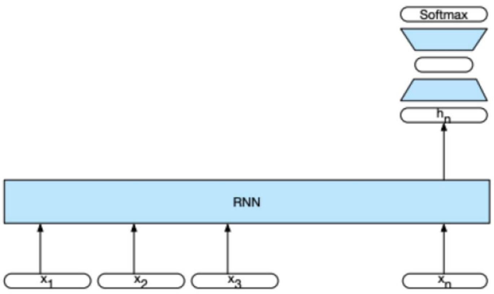

flowchart

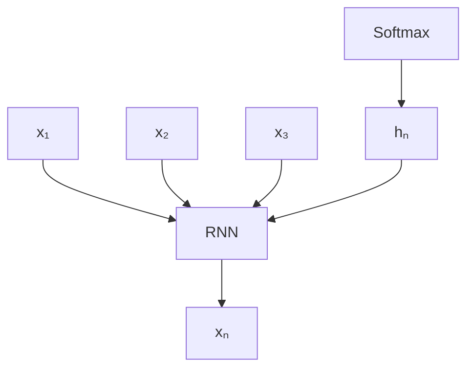
```mermaid
graph TD
    A["x₁"] --> B["RNN"]
    C["x₂"] --> B
    D["x₃"] --> B
    B --> E["xₙ"]
    F["Softmax"] --> G["hₙ"]
    G --> B
```

# Other Important Architectures

Produce an output at each time step and have recurrent connections only from the output of one time step to the hidden units at the next time step

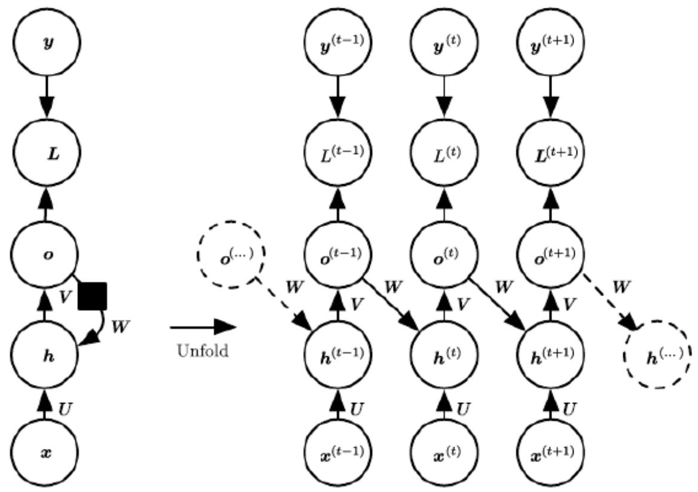

flowchart

```mermaid
graph TD
    A["y"] --> B["L"]
    B --> C["o"]
    C --> D["h"]
    D --> E["x"]
    F["y^{(t-1)"]] --> G["L^{(t-1)}"]
    G --> H["o^{(t-1)}"]
    H --> I["h^{(t-1)}"]
    I --> J["x^{(t-1)}"]
    K["y^{(t)"]] --> L["L^{(t)}"]
    L --> M["o^{(t)}"]
    M --> N["h^{(t)}"]
    N --> O["x^{(t)}"]
    P["y^{(t+1)}"] --> Q["L^{(t+1)}"]
    Q --> R["o^{(t+1)}"]
    R --> S["h^{(t+1)}"]
    S --> T["x^{(t+1)}"]
    U["Unfold"] -.-> V["O^{(...)}"]
    V -.-> W["W"]
    X["W"] -.-> Y["W"]
    Z["U"] -.-> AA["U"]
```

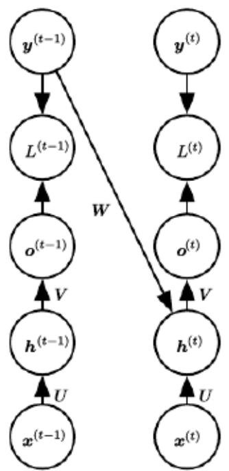

flowchart

```mermaid
graph TD
    A["x^{(t-1)}"] -->|U| B["h^{(t-1)}"]
    B -->|V| C["o^{(t-1)}"]
    C -->|W| D["L^{(t-1)}"]
    D --> E["y^{(t-1)}"]
    E --> F["y^{(t)}"]
    F --> G["L^{(t)}"]
    G --> H["o^{(t)}"]
    H --> I["h^{(t)}"]
    I --> J["u"]
    style A fill:#f9f,stroke:#333
    style B fill:#f9f,stroke:#333
    style C fill:#f9f,stroke:#333
    style D fill:#f9f,stroke:#333
    style E fill:#f9f,stroke:#333
    style F fill:#f9f,stroke:#333
    style G fill:#f9f,stroke:#333
    style H fill:#f9f,stroke:#333
    style I fill:#f9f,stroke:#333
    style J fill:#f9f,stroke:#333
```

$$
\log p (y ^ {(1)}, y ^ {(2)} \mid x ^ {(1)}, x ^ {(2)}) =
$$

$$
\log p \left(y ^ {(2)} \mid y ^ {(1)}, x ^ {(1)}, x ^ {(2)}\right) + \log p \left(y ^ {(1)} \mid , x ^ {(1)}, x ^ {(2)}\right)
$$

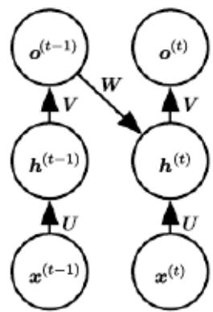

flowchart

```mermaid
graph TD
    O1["o^{(t-1)}"] -->|V| H1["h^{(t-1)}"]
    O2["o^{(t)}"] -->|V| H2["h^{(t)}"]
    H1 -->|U| X1["x^{(t-1)}"]
    H2 -->|U| X2["x^{(t)}"]
    style O1 fill:#fff,stroke:#000
    style O2 fill:#fff,stroke:#000
    style H1 fill:#fff,stroke:#000
    style H2 fill:#fff,stroke:#000
    style X1 fill:#fff,stroke:#000
    style X2 fill:#fff,stroke:#000
```

Test time   
Figure 10.6:Ilustration of teacher forcing. Teacher forcing is a training technique that is applicable to RNNs that have connections from their output to their hidden states at the next time step. $( L e f t )$ At train time,we feed the correct output $\mathbf { \boldsymbol { y } } ^ { ( t ) }$ drawn from the train set as input to $h ^ { ( t + 1 ) }$ .(Right)When the model is deployed, the true output is generally not known. In this case, we approximate the correct output $\boldsymbol { y } ^ { ( t ) }$ with the model's output $\mathbf { \sigma } _ { o } ( t )$ ,and feed the output back into the model.

# Other Important Architectures

Bidirectional RNNs

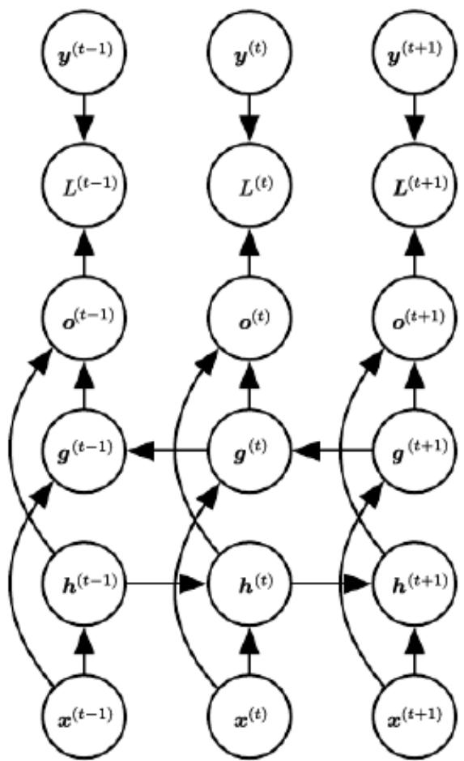

flowchart

```mermaid
graph TD
    A["x^{(t-1)}"] --> B["h^{(t-1)}"]
    B --> C["g^{(t-1)}"]
    C --> D["x^{(t)}"]
    D --> E["y^{(t-1)}"]
    E --> F["y^{(t)}"]
    F --> G["O(t)"]
    G --> H["g^{(t+1)}"]
    H --> I["x^{(t+1)}"]
    I --> J["y^{(t+1)}"]
    J --> K["L^{(t+1)}"]
    K --> L["y^{(t-1)}"]
    L --> M["L^{(t-1)}"]
    M --> N["o^{(t-1)}"]
    N --> O["o^{(t)}"]
    O --> P["O^{(t+1)}"]
    P --> Q["O^{(t+1)}"]
    Q --> R["O^{(t+1)}"]
    R --> S["O^{(t+1)}"]
    S --> T["O^{(t+1)}"]
    T --> U["O^{(t+1)}"]
    U --> V["O^{(t+1)}"]
    V --> W["O^{(t+1)}"]
    W --> X["O^{(t+1)}"]
    X --> Y["O^{(t+1)}"]
    Y --> Z["O^{(t+1)}"]
    Z --> AA["O^{(t+1)}"]
    AA --> AB["O^{(t+1)}"]
    AB --> AC["O^{(t+1)}"]
    AC --> AD["O^{(t+1)}"]
    AD --> AE["O^{(t+1)}"]
    AE --> AF["O^{(t+1)}"]
```

# Other Important Architectures

# Bidirectional RNN

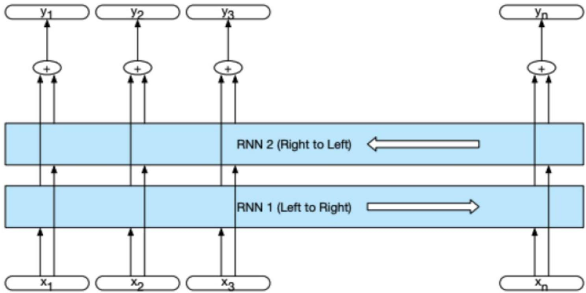

flowchart

```mermaid
graph TD
    subgraph RNN 1 (Left to Right)
        x1 --> y1
        x1 --> y2
        x1 --> y3
        x2 --> y1
        x2 --> y2
        x2 --> y3
        x3 --> y1
        x3 --> y2
        x3 --> y3
    end
    subgraph RNN 2 (Right to Left)
        y1 --> y2
        y2 --> y3
        y3 --> yn
    end
    style RNN 1 fill:#cce5ff,stroke:#333
    style RNN 2 fill:#cce5ff,stroke:#333
```

# Other Important Architectures

# Encoder-Decoder :

Sequence-to-Sequence Architectures Mapping sequence to sequence of different length

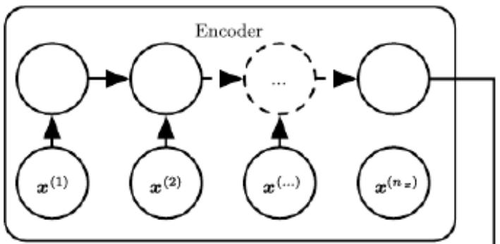

flowchart

```mermaid
graph LR
    A["Input x(1)"] --> B["Hidden Layer"]
    C["Input x(2)"] --> B
    D["Input x(...)"] --> B
    E["Input x(n=)"] --> B
    B --> F["..."]
    F --> G["Output"]
    style F stroke-dasharray: 5 5
    note right of F Encoder
```

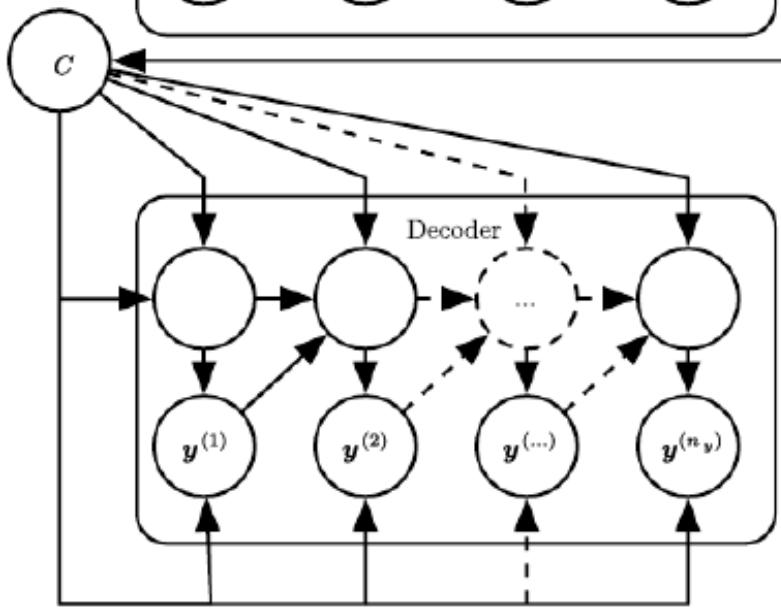

flowchart

```mermaid
graph TD
    C["C"] --> A["Layer 1"]
    A --> B["Layer 2"]
    B --> C["..."]
    C --> D["Layer n_y"]
    D --> E["Output"]
    subgraph Decoder
        F["y^(1)"]
        G["y^(2)"]
        H["y^(...)"]
    end
    subgraph Output
        I["Output"]
    end
    A --> J["Decoder"]
    B --> J
    C --> J
    D --> J
    E --> J
    F --> J
    G --> J
    H --> J
    I --> J
```

# Other Important Architectures

# Encoder-Decoder

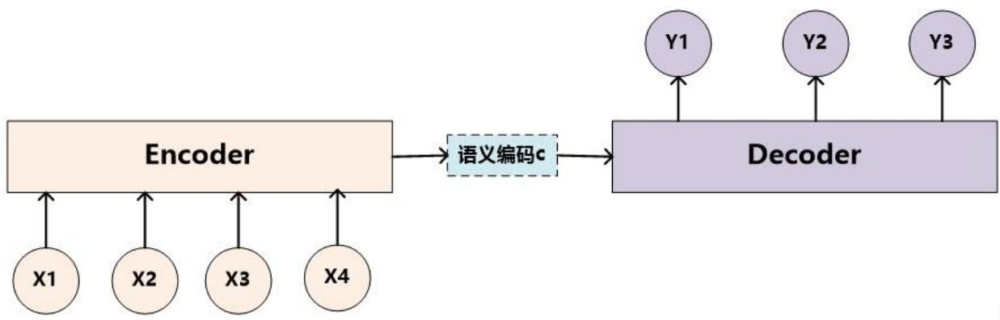

flowchart

```mermaid
graph LR
    A["Encoder"] --> B["语义编码c"]
    C["X1"] --> A
    D["X2"] --> A
    E["X3"] --> A
    F["X4"] --> A
    G["Y1"] --> H["Decoder"]
    I["Y2"] --> H
    J["Y3"] --> H
```

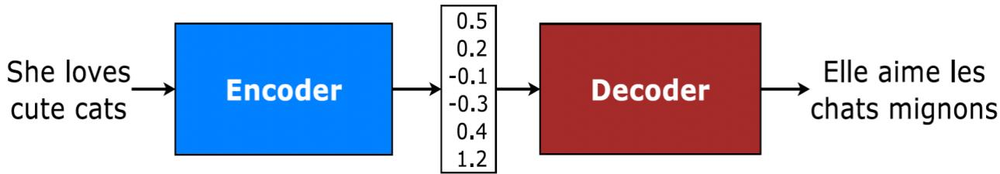

flowchart

```mermaid
graph LR
    A["She loves cute cats"] --> B["Encoder"]
    B --> C["0.5\n0.2\n-0.1\n-0.3\n0.4\n1.2"]
    C --> D["Decoder"]
    D --> E["Elle aime les chats mignons"]
```

# Other Important Architectures

# Encoder-Decoder

translation generated   
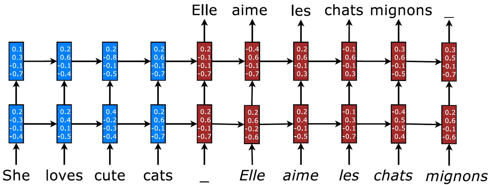

bar

| Category   | She    | loves  | cute   | cats   | Elle   | aime   | les    | chats  | mignons |
| ---------- | ------ | ------ | ------ | ------ | ------ | ------ | ------ | ------ | ------- |
| She        | 0.1    | 0.2    | 0.4    | 0.2    | 0.2    | -0.4   | 0.2    | -0.1   | 0.3     |
| loves      | 0.3    | 0.6    | 0.1    | 0.4    | 0.6    | -0.1   | 0.6    | -0.1   | 0.5     |
| cute       | -0.1   | -0.8   | -0.1   | -0.2   | -0.1   | -0.7   | -0.1   | -0.1   | -0.1    |
| cats       | -0.7   | -0.1   | -0.3   | -0.1   | -0.7   | -0.7   | -0.7   | -0.5   | -0.7    |
| Elle       | -0.4   | 0.6    | -0.2   | 0.2    | 0.6    | -0.2   | 0.2    | -0.1   | 0.3     |
| aime       | -0.7   | -0.1   | -0.6   | 0.2    | 0.4    | -0.6   | -0.1   | -0.7   | 0.4     |
| les        | 0.3    | 0.6    | 0.3    | 0.3    | 0.6    | -0.1   | 0.3    | -0.1   | 0.5     |
| chats      | 0.5    | -0.1   | 0.5    | 0.4    | 0.5    | -0.1   | 0.5    | -0.1   | 0.6     |
| mignons    | -0.1   | -0.1   | -0.4   | 0.2    | 0.6    | -0.1   | 0.2    | -0.1   | 0.2     |

source sentence

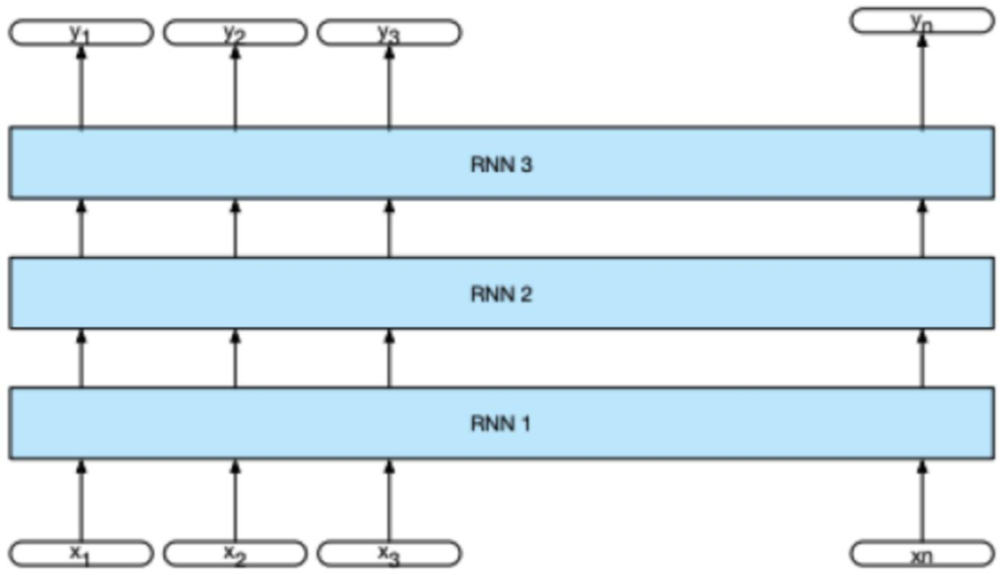

flowchart

```mermaid
graph TD
    subgraph RNN_1
        x1 --> RNN_2
        x2 --> RNN_2
        x3 --> RNN_2
    end
    subgraph RNN_2
        RNN_3
    end
    subgraph RNN_3
        y1 --> RNN_1
        y2 --> RNN_1
        y3 --> RNN_1
    end
    subgraph RNN_1
        xn --> RNN_1
        xn --> RNN_2
        xn --> RNN_3
    end
    RNN_1 --> yn
    RNN_2 --> yn
    RNN_3 --> yn
```

First presented by Hochreiter and Schmidhuber (1997)   
• Idea   
– The gradient can flow for long durations   
• extremely successful in many applications   
– Handwriting recognition, speech recognition   
– Handwriting generation, image captioning   
– Machine translation   
– Parsing

natural_image

Portrait of a man speaking into a headset, wearing a white shirt against a blurred blue and green background (no visible text or symbols)

Jürgen Schmidhuber

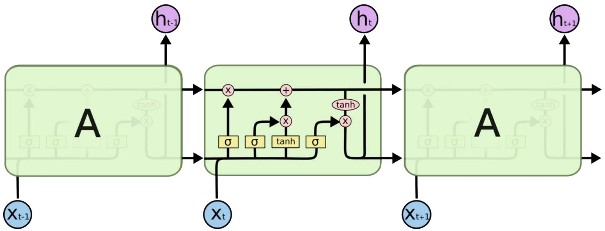

flowchart

```mermaid
graph LR
    subgraph Input
        Xt-1["X_{t-1}"] --> A["A"]
        Xt --> Xt1["X_{t+1}"]
    end

    h_t_minus_1["h_{t-1}"] --> A
    h_t --> X_t["X_t"]
    X_t --> X_t_minus_1
    X_t --> X_t1

    h_t_minus_1 --> A
    h_t --> X_t
    X_t --> X_t_minus_1

    h_t --> X_t_minus_1
    X_t --> X_t

    X_t --> X_t_minus_1

    X_t --> X_t

    X_t --> X_t_minus_1

    X_t --> X_t

    X_t --> X_t_minus_1

    X_t --> X_t

    X_t --> X_t

    X_t --> X_t

    X_t --> X_t

    X_t --> X_t

    X_t --> X_t

    X_t --> X_t

    X_t --> X_t

    X_t --> X_t

    X_t --> X_t

    X_t --> X_t

    X_t --> X_t

    X_t --> X_t

    X_t --> X_t

    X_t --> X_t
```

# LSTM

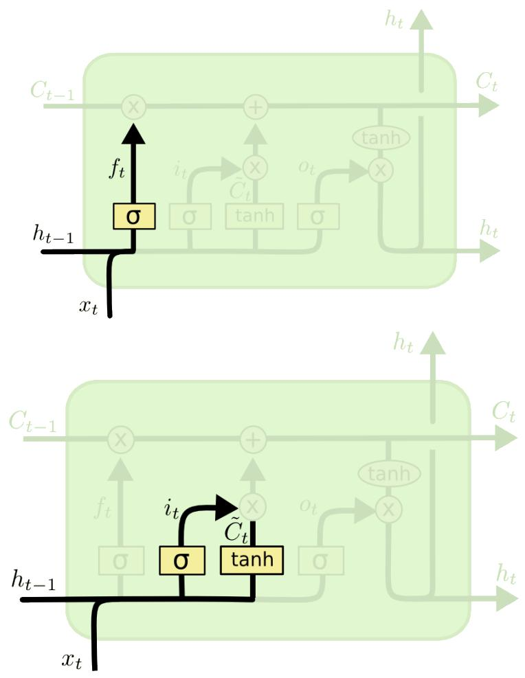

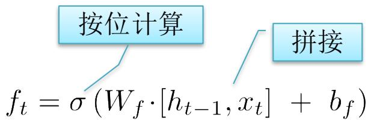

text_image

按位计算
拼接
f_t = σ (W_f \cdot [h_{t-1}, x_t] + b_f)

$$
i _ {t} = \sigma \left(W _ {i} \cdot [ h _ {t - 1}, x _ {t} ] + b _ {i}\right)
$$

$$
\tilde {C} _ {t} = \mathrm{tanh} (W _ {C} \cdot [ h _ {t - 1}, x _ {t} ] + b _ {C})
$$

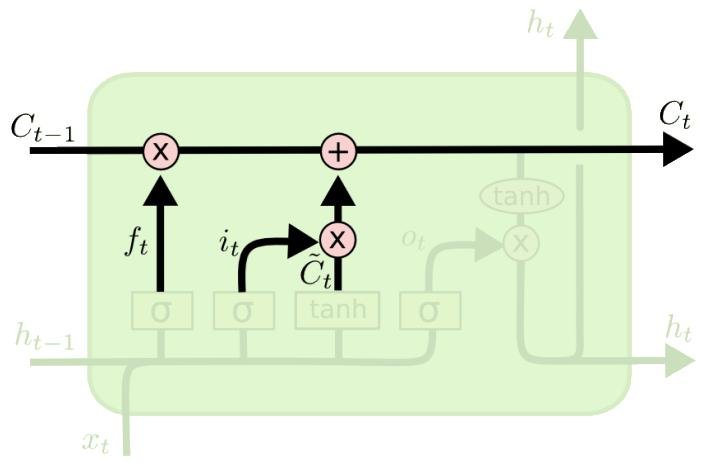

flowchart

```mermaid
graph TD
    A["C_{t-1}"] --> B["×"]
    B --> C["+"]
    D["h_t"] --> E["tanh"]
    F["x_t"] --> G["σ"]
    H["h_t-1"] --> I["σ"]
    J["i_t"] --> K["×"]
    L["C_t"] --> M["×"]
    N["O_t"] --> O["×"]
    P["θ_t"] --> Q["×"]
    R["f_t"] --> S["×"]
    T["×"] --> U["×"]
    V["×"] --> W["×"]
    X["×"] --> Y["×"]
    Z["×"] --> AA["×"]
```

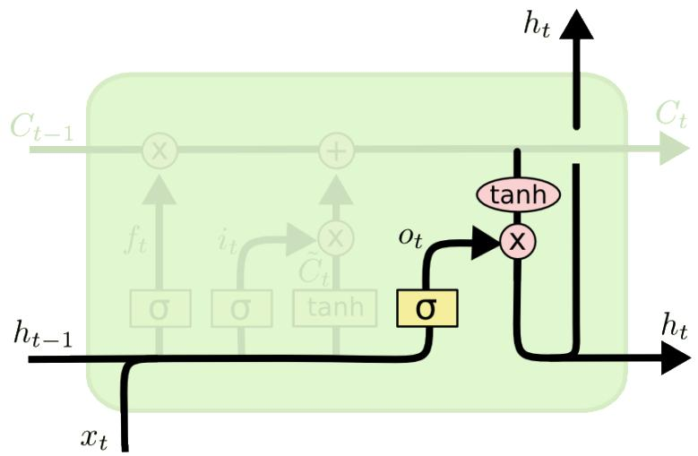

flowchart

```mermaid
graph TD
    A["σ"] --> B["×"]
    C["σ"] --> D["×"]
    E["tanh"] --> F["×"]
    G["σ"] --> H["×"]
    I["ct"] --> J["xt"]
    K["ft"] --> L["×"]
    M["ft-1"] --> N["xt-1"]
    O["ct-1"] --> P["xt-1"]
    Q["ct"] --> R["xt"]
    S["ct"] --> T["xt"]
    U["ct-1"] --> V["xt-1"]
    W["ct"] --> X["xt"]
    Y["ct-1"] --> Z["xt-1"]
    AA["ct"] --> AB["xt"]
    AC["ct-1"] --> AD["xt"]
    AE["ct"] --> AF["xt"]
    AG["ct-1"] --> AH["xt"]
    AI["ct"] --> AJ["xt"]
    AK["ct-1"] --> AL["xt"]
    AM["ct"] --> AN["xt"]
    AO["ct-1"] --> AP["xt"]
    AQ["ct"] --> AR["xt"]
    AS["ct-1"] --> AT["xt"]
    AU["ct"] --> AV["xt"]
    AW["ct-1"] --> AX["xt"]
```

点乘

$$
C _ {t} = f _ {t} * C _ {t - 1} + i _ {t} * \tilde {C} _ {t}
$$

$$
o _ {t} = \sigma \left(W _ {o} \left[ h _ {t - 1}, x _ {t} \right] + b _ {o}\right)
$$

$$
h _ {t} = o _ {t} * \tanh (C _ {t})
$$

# LSTM

$$
f _ {t} = \sigma \left(W _ {f} \cdot \left[ h _ {t - 1}, x _ {t} \right] + b _ {f}\right)
$$

$$
i _ {t} = \sigma \left(W _ {i} \cdot \left[ h _ {t - 1}, x _ {t} \right] + b _ {i}\right)
$$

$$
\tilde {C} _ {t} = \tanh (W _ {C} \cdot [ h _ {t - 1}, x _ {t} ] + b _ {C})
$$

$$
C _ {t} = f _ {t} * C _ {t - 1} + i _ {t} * \tilde {C} _ {t}
$$

$$
o _ {t} = \sigma \left(W _ {o} \left[ h _ {t - 1}, x _ {t} \right] + b _ {o}\right)
$$

$$
h _ {t} = o _ {t} * \tanh \left(C _ {t}\right)
$$

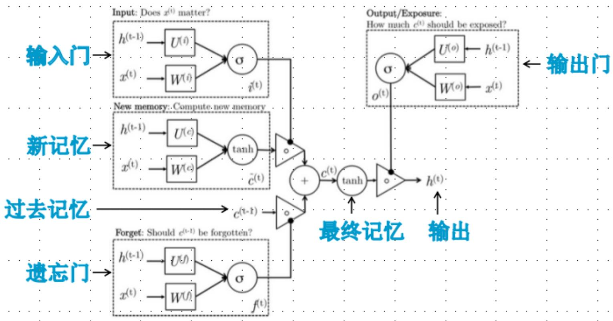

flowchart

```mermaid
graph TD
    A["输入门"] --> B["h^(t-1)"]
    A --> C["x^(t)"]
    B --> D["U^(i)"]
    C --> E["W^(i)"]
    D --> F["σ"]
    E --> G["i^(t)"]
    F --> H["+"]
    G --> H
    H --> I["tanh"]
    I --> J["+"]
    K["新记忆"] --> L["h^(t-1)"]
    K --> M["x^(t)"]
    L --> N["U^(c)"]
    M --> O["W^(c)"]
    N --> P["tanh"]
    O --> P
    P --> Q["+"]
    R["过去记忆"] --> S["c^(t-1)"]
    T["遗忘门"] --> U["h^(t-1)"]
    T --> V["x^(t)"]
    U --> W["U^(f)"]
    V --> X["W^(f)"]
    W --> Y["σ"]
    X --> Y
    Y --> Z["f^(t)"]
    AA["最终记忆"] --> AB["c^(t)"]
    AC["输出"] --> AD["h^(t)"]
    AE["Output/Exposure"] --> AF["U^(o)"]
    AE --> AG["W^(o)"]
    AF --> AH["h^(t-1)"]
    AG --> AI["x^(t)"]
    style A fill:#fff,stroke:#000
    style K fill:#fff,stroke:#000
    style AA fill:#fff,stroke:#000
    style AB fill:#fff,stroke:#000
    style AC fill:#fff,stroke:#000
    style AD fill:#fff,stroke:#000
    style AE fill:#fff,stroke:#000
```

# • A simplification version of LSTM

– First presented in 2014

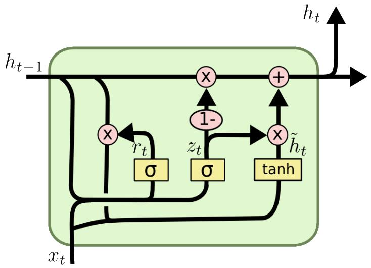

flowchart

```mermaid
graph TD
    A["xt"] --> B["x"]
    B --> C["r_t"]
    C --> D["σ"]
    D --> E["z_t"]
    E --> F["σ"]
    F --> G["1-"]
    G --> H["x"]
    H --> I["+"]
    I --> J["ht"]
    J --> K["ht-1"]
    style A fill:#f9f,stroke:#333
    style K fill:#ccf,stroke:#333
```

$$
z _ {t} = \sigma \left(W _ {z} \cdot [ h _ {t - 1}, x _ {t} ]\right)
$$

$$
r _ {t} = \sigma \left(W _ {r} \cdot [ h _ {t - 1}, x _ {t} ]\right)
$$

$$
\tilde {h} _ {t} = \tanh \left(W \cdot [ r _ {t} * h _ {t - 1}, x _ {t} ]\right)
$$

$$
h _ {t} = (1 - z _ {t}) * h _ {t - 1} + z _ {t} * \tilde {h} _ {t}
$$

text_image

北京大学
Peking University
谢谢！
谢谢
Thanks
66

