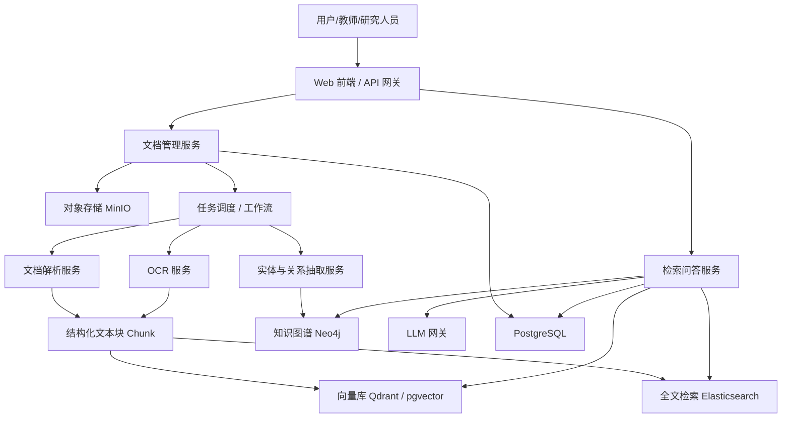

# AI 论文与大学课件知识图谱管理系统技术方案

## 1. 项目定位

本系统定位为一个面向 AI 相关论文、大学课件、教材章节与课程资料的知识资产平台。它不仅提供文档管理能力，还将文档内容结构化为知识图谱，并结合向量检索与大模型能力，形成可检索、可问答、可推理、可推荐的智能知识系统。

核心目标如下：

- 管理 AI 论文、课程课件、教材章节、课程大纲、概念术语等知识资产
- 将非结构化文档转化为结构化知识图谱
- 支持全文检索、语义检索、图谱检索与智能问答
- 支持课程知识地图、论文研究地图、学习路径推荐与综述生成
- 为科研、教学、学习三类用户提供统一知识底座

---

## 2. 建设目标

### 2.1 管理对象

系统需要支持以下对象的统一管理：

- AI 论文
- 大学课件 `PPT/PDF`
- 教材章节
- 课程大纲
- 概念术语
- 模型、算法、任务、数据集、指标
- 作者、教师、机构、课程

### 2.2 核心能力

- 文档上传与管理
- 文档解析与结构化抽取
- 实体识别与关系抽取
- 知识图谱构建与维护
- 向量化索引与语义检索
- 图谱增强问答 `GraphRAG`
- 学习路径推荐
- 自动综述生成
- 图谱可视化与审核

### 2.3 典型应用场景

- 输入一篇论文，自动抽取其任务、方法、数据集、指标、结论与局限性
- 输入一门课程课件，自动生成章节树、知识点关系图和先修路径
- 查询“Transformer 在哪些课程章节中被讲解，并关联了哪些经典论文”
- 查询“从 CNN 到 ViT 的演化路径及关键论文”
- 比较“Diffusion Model 与 GAN 在课程讲解与论文表述中的差异”

---

## 3. 总体架构设计

推荐采用四层架构：

- 文档接入层
- 数据处理层
- 知识存储层
- AI 应用层

### 3.1 架构分层

#### 1）接入层

负责文档上传、管理后台、开放 API 与用户访问。

包含模块：

- Web 管理后台
- 教师/研究人员上传入口
- 外部数据导入接口
- 检索与问答前端

#### 2）数据处理层

负责文档解析、OCR、切块、抽取与索引构建。

包含模块：

- 文件解析服务
- OCR 服务
- 文本清洗与切块服务
- 元数据抽取服务
- 实体识别服务
- 关系抽取服务
- 图谱融合服务

#### 3）知识存储层

负责原始文件、结构化数据、图谱关系与向量索引的统一存储。

包含模块：

- 对象存储
- 关系型数据库
- 图数据库
- 向量数据库
- 全文检索引擎

#### 4）AI 应用层

负责智能问答、GraphRAG、综述生成、学习推荐与推理分析。

包含模块：

- 大模型接入网关
- 检索编排引擎
- 图谱推理服务
- 综述生成服务
- 学习路径推荐服务

### 3.2 推荐架构图

### 3.3 架构原则

- 以知识图谱为骨架
- 以向量检索为语义召回层
- 以大模型为智能交互与总结层
- 以异步任务流支持大规模文档处理
- 以人工审核保证学术场景准确性与可解释性

---

## 4. 技术选型建议

### 4.1 后端

首选：

- `Python + FastAPI`

原因：

- 适配 NLP、知识图谱、LLM 生态
- 与 OCR、向量检索、文本抽取工具链兼容性高
- 开发效率高，适合 MVP 快速落地

备选：

- `Java + Spring Boot`

适合组织已有 Java 技术栈，但 AI 编排效率通常低于 Python。

### 4.2 前端

推荐：

- `React + Next.js`
- 或 `Vue 3 + Vite`

图谱可视化推荐：

- `AntV G6`
- `Cytoscape.js`
- `ECharts Graph`

### 4.3 存储与检索

推荐组合：

- `PostgreSQL`：业务数据、用户、权限、任务、配置
- `Neo4j`：知识图谱存储
- `Qdrant / pgvector / Milvus`：向量检索
- `Elasticsearch / OpenSearch`：全文检索
- `MinIO`：原始文件对象存储

中型项目推荐组合：

- `PostgreSQL + Neo4j + Qdrant + MinIO`

### 4.4 文档解析与 AI 能力

文档解析：

- `PyMuPDF`
- `pdfplumber`
- `python-pptx`
- `PaddleOCR`

NLP / 知识抽取：

- `spaCy`
- `HanLP`
- `transformers`

RAG / 编排：

- `LlamaIndex`
- `LangChain`

Embedding 模型建议：

- `bge-m3`
- `bge-large-zh`
- `gte-Qwen`

重排序模型建议：

- `bge-reranker`

大模型建议：

- `Qwen`
- `DeepSeek`
- `Claude`
- `GPT`

---

## 5. 数据模型设计

建议采用“文档层 + 知识层”的双模型设计。

### 5.1 文档层实体

- `Document`
- `Paper`
- `Courseware`
- `Course`
- `Chapter`
- `Section`
- `Slide`
- `Chunk`
- `Author`
- `Teacher`
- `Institution`

### 5.2 知识层实体

- `Concept`
- `Method`
- `Model`
- `Task`
- `Dataset`
- `Metric`
- `Formula`
- `Experiment`

### 5.3 关系设计示例

- `Paper -[:WRITTEN_BY]-> Author`
- `Paper -[:PROPOSES]-> Method`
- `Method -[:SOLVES]-> Task`
- `Paper -[:USES]-> Dataset`
- `Paper -[:EVALUATED_BY]-> Metric`
- `Paper -[:CITES]-> Paper`
- `Course -[:HAS_CHAPTER]-> Chapter`
- `Chapter -[:EXPLAINS]-> Concept`
- `Concept -[:PREREQUISITE_OF]-> Concept`
- `Concept -[:RELATED_TO]-> Method`
- `Chunk -[:MENTIONS]-> Concept`
- `Courseware -[:BELONGS_TO]-> Course`

### 5.4 图谱分层建议

- `L0 元数据层`：标题、作者、年份、来源、课程名、院校、教师
- `L1 文档结构层`：章节、页码、页块、段落、公式、图表
- `L2 语义实体层`：概念、模型、算法、任务、数据集、指标
- `L3 关系层`：引用、依赖、改进、应用、对比、先修
- `L4 推理层`：学习路径、研究演化、知识关联、热点分析

---

## 6. 文档处理流水线

系统应采用异步处理流水线，支持批量导入与增量更新。

### 6.1 处理流程

#### 1）数据接入

支持导入：

- `PDF`
- `PPTX`
- `DOCX`
- `HTML`
- `Markdown`
- 外部论文源，例如 `arXiv`

#### 2）文档解析

抽取内容包括：

- 标题
- 摘要
- 目录
- 正文
- 章节结构
- 图表与公式
- 参考文献

#### 3）OCR 识别

针对扫描版 PDF、图片型课件进行 OCR，保证文本可进入检索与抽取链路。

#### 4）文本清洗与切块

推荐按以下策略切块：

- 按章节切分
- 按语义段落切分
- 保留页码、标题路径、文档来源
- 为每个块记录上游文档 ID 和定位信息

#### 5）元数据抽取

论文抽取：

- 作者
- 机构
- 年份
- 关键词
- 摘要
- 引文信息

课件抽取：

- 课程名
- 教师名
- 学校名
- 章节结构
- 知识点
- 示例与习题

#### 6）实体识别

抽取如下实体：

- 模型名
- 方法名
- 任务名
- 数据集
- 指标
- 关键术语

#### 7）关系抽取

示例关系：

- A 改进 B
- A 解决 B
- A 使用 B
- A 在数据集 B 上优于 C
- 课程章节 A 依赖概念 B

#### 8）图谱融合与索引构建

核心操作：

- 同义词归并
- 实体消歧
- 版本融合
- 图谱写入
- 向量索引
- 全文索引

#### 9）审核与发布

对低置信度三元组进行人工审核后再正式发布。

---

## 7. 知识抽取策略

不建议仅依赖规则或仅依赖大模型，推荐采用混合式抽取架构。

### 7.1 推荐方案

- `规则层`：处理结构化强、边界清晰的信息
- `NER / 分类模型层`：抽取标准实体
- `LLM 抽取层`：处理复杂语义关系
- `置信度融合层`：综合多源结果形成评分
- `人工审核层`：审核低置信度结果

### 7.2 各层适用内容

规则层适合：

- 标题
- 页码
- 参考文献
- 章节目录
- 课程元数据

NER / 分类层适合：

- 数据集
- 任务
- 模型名
- 指标名

LLM 抽取层适合：

- 创新点
- 贡献总结
- 局限性
- 方法比较关系
- 课程知识依赖关系

---

## 8. 图谱构建与融合

### 8.1 构建方式

- `离线构建`：批量导入历史论文和课件
- `增量构建`：新文档上传后自动更新
- `版本化更新`：跟踪文档版本变化与图谱修订

### 8.2 图谱融合重点

- 同名实体合并，例如 “Self-Attention” 与 “自注意力”
- 同一论文多个来源合并，例如预印本与正式发表版本
- 课程知识点跨教师课件对齐
- 术语在不同课程上下文中的多义处理

### 8.3 本体设计建议

初期不宜设计过于复杂的本体，建议：

- 首期定义 `15-30` 类实体
- 首期定义 `20-40` 类关系
- 支持后续扩展与版本管理

---

## 9. AI 能力设计

### 9.1 检索能力

系统需要同时支持：

- 关键词检索
- 全文检索
- 向量语义检索
- 图谱路径检索
- 混合检索 `BM25 + Vector + Graph`

### 9.2 问答能力

支持回答：

- 概念定义类问题
- 论文对比类问题
- 方法演化类问题
- 课程先修依赖类问题
- 学习路线类问题

问答结果必须带：

- 证据片段
- 来源文档
- 图谱关系路径

### 9.3 综述生成

支持：

- 主题研究综述生成
- 方法时间线总结
- 课程章节总结
- 指定文献集合综述

### 9.4 推荐能力

- 学习路径推荐
- 相关论文推荐
- 相关课程资源推荐
- 方法与数据集关联推荐

---

## 10. GraphRAG 方案

本场景不应只做普通 RAG，而应采用知识图谱增强的 `GraphRAG` 思路。

### 10.1 处理流程

#### Step 1：问题理解

识别用户问题中的核心实体、主题与意图。

#### Step 2：图谱检索

在图数据库中查找：

- 目标实体
- 邻接节点
- 关键关系
- 路径与子图

#### Step 3：向量召回

从向量库中召回相关原文片段。

#### Step 4：重排序与上下文组装

结合图谱路径、相关 chunk、关键词检索结果进行统一排序。

#### Step 5：LLM 生成答案

基于结构化路径与原文证据生成答案，并输出来源说明。

### 10.2 场景示例

问题示例：

“Diffusion Model 和 GAN 的核心差别是什么，在哪些课程章节中有讲解？”

系统处理方式：

- 图谱负责找到 `Diffusion Model`、`GAN`、相关课程章节
- 向量库召回原文解释片段
- 重排序模块筛选最强证据
- LLM 汇总为结构化可解释答案

---

## 11. 微服务拆分建议

### 11.1 服务列表

- `gateway-service`
- `document-service`
- `parser-service`
- `ocr-service`
- `kg-service`
- `retrieval-service`
- `llm-service`
- `workflow-service`
- `frontend`

### 11.2 职责说明

`gateway-service`

- API 网关
- 鉴权
- 限流
- 路由转发

`document-service`

- 文档上传
- 版本管理
- 元数据管理

`parser-service`

- PDF / PPT / DOCX 解析
- 文本清洗
- 结构化输出

`ocr-service`

- 扫描版 OCR
- 图片文本抽取

`kg-service`

- 实体抽取
- 关系抽取
- 图谱写入
- 图谱查询

`retrieval-service`

- 全文检索
- 向量检索
- 混合检索
- 重排序

`llm-service`

- 模型接入
- Prompt 管理
- 问答编排
- 综述生成

`workflow-service`

- 异步任务编排
- 批处理
- 重试
- 状态跟踪

---

## 12. 接口设计建议

### 12.1 文档管理

- `POST /documents/upload`
- `GET /documents/{id}`
- `POST /documents/{id}/parse`
- `GET /documents/{id}/status`

### 12.2 图谱管理

- `GET /graph/entities`
- `GET /graph/relations`
- `GET /graph/subgraph`
- `POST /graph/merge`

### 12.3 检索问答

- `POST /search/hybrid`
- `POST /qa/ask`
- `POST /summary/review`

### 12.4 工作流

- `POST /jobs/extract`
- `GET /jobs/{id}/status`

---

## 13. 前端功能模块

### 13.1 知识资产台

- 上传论文、课件、教材
- 查看文档解析结果
- 查看抽取状态与版本信息

### 13.2 图谱浏览器

- 关系图可视化
- 节点展开
- 多条件筛选
- 论文、作者、概念、课程联动浏览

### 13.3 智能问答台

- 多轮追问
- 来源证据展示
- 图谱路径展示
- 结果收藏与导出

### 13.4 课程知识地图

- 章节树
- 知识点关系图
- 先修路径图

### 13.5 论文研究地图

- 时间线
- 引用网络
- 方法演化链

### 13.6 审核台

- 审核实体合并
- 审核低置信度关系
- 纠正错误抽取

---

## 14. 权限与角色

推荐角色设计：

- `管理员`：管理用户、权限、本体、数据源与全局配置
- `教师/专家`：审核抽取结果、维护课程图谱、补充知识点
- `研究人员/学生`：查询、问答、收藏、标注、学习
- `系统服务账号`：执行异步任务、构建索引、同步图谱

---

## 15. 非功能设计

### 15.1 可扩展性

- 所有解析、抽取、索引任务异步化
- 支持横向扩展的任务处理架构

### 15.2 可观测性

- 统一日志
- 链路追踪
- 指标监控
- 异常告警

### 15.3 可审计性

- 每条三元组保留来源文档
- 保留抽取时间、版本号、置信度
- 支持人工修改记录追踪

### 15.4 可解释性

- 问答输出必须附带来源文档与证据片段
- 图谱关系需可回溯到原始文本

### 15.5 可维护性

- 本体可配置
- Prompt 可配置
- 抽取规则可配置
- 模型可替换

---

## 16. 项目实施路线

建议分三期推进，降低复杂度与落地风险。

### 16.1 一期：MVP

目标：跑通“上传 -> 解析 -> 检索 -> 问答”的基础闭环。

功能范围：

- 文档上传与管理
- PDF / PPT 文本抽取
- Chunk 切分
- Embedding 入库
- 基础语义检索
- 基础问答
- 初版图谱：论文、作者、课程、概念、引用

推荐技术组合：

- `FastAPI + React`
- `PostgreSQL + Neo4j + Qdrant + MinIO`

### 16.2 二期：图谱增强

目标：形成可用的知识图谱与审核机制。

功能范围：

- 实体识别
- 关系抽取
- 实体消歧
- 图谱可视化
- 审核工作台
- 学习路径推荐
- 初步综述生成

### 16.3 三期：智能化升级

目标：形成科研与教学辅助平台。

功能范围：

- GraphRAG
- 自动专题综述
- 研究演化分析
- 个性化推荐
- 多模态理解 `图/表/公式`

---

## 17. 时间规划建议

### 第 1 个月

- 完成本体初稿设计
- 搭建基础后端与前端框架
- 打通文档上传与存储流程
- 实现基础 PDF / PPT 解析

### 第 2 个月

- 完成切块与向量化
- 接入向量检索
- 实现基础检索与问答

### 第 3 个月

- 接入 Neo4j
- 实现基础实体抽取与关系抽取
- 写入初版图谱

### 第 4 个月

- 完成图谱可视化
- 增加审核流程
- 上线第一版

### 第 5-6 个月

- 建设 GraphRAG
- 完成推荐与综述能力
- 进行性能优化与准确率优化

---

## 18. 关键难点与风险

### 18.1 实体消歧

同一术语在不同论文与课程语境中的含义可能不同，需要设计统一别名和上下文判断机制。

### 18.2 课件质量不稳定

大学课件往往结构松散、目录不清晰、图文混排严重，容易影响抽取质量。

### 18.3 图表与公式理解

常规文本抽取对图、表、公式支持有限，后续可能需要多模态模型补强。

### 18.4 关系抽取准确率

特别是“改进了什么”“与谁对比”“局限性是什么”这类复杂学术语义，容易误抽取。

### 18.5 结果可信度

学术场景必须强调证据可追溯、答案可解释、关系可审核。

---

## 19. 推荐结论

综合考虑项目价值、可实施性与后续演进空间，推荐采用以下总体方案：

- 以知识图谱作为核心知识骨架
- 以向量检索与全文检索作为语义召回与精确检索补充
- 以大模型作为交互、总结、综述和推理增强层
- 以规则抽取、模型抽取和人工审核的混合方式控制准确率
- 以异步任务与分层架构支撑可扩展性

推荐技术组合如下：

- 后端：`FastAPI`
- 前端：`React + Next.js`
- 业务数据库：`PostgreSQL`
- 图数据库：`Neo4j`
- 向量数据库：`Qdrant`
- 对象存储：`MinIO`
- 全文检索：`Elasticsearch`（可作为增强项）
- AI 能力：`Embedding + Reranker + LLM`

系统最终定位建议为：

`AI 学术知识中台 + 图谱检索引擎 + 智能问答平台`

---

## 20. 下一步建议

建议下一步继续输出以下三项中的一个：

1. 系统架构图细化版
2. 数据库与图谱 Schema 设计
3. MVP 0 到 1 实施计划

如果继续推进，建议优先产出以下文档：

- `总体架构设计文档`
- `数据模型与本体设计文档`
- `MVP 迭代计划`
- `接口设计文档`
- `知识抽取策略文档`
